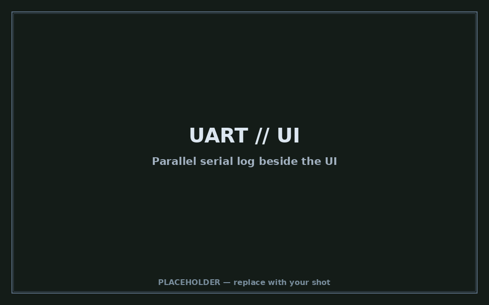

# Metal

Freestanding **os-ish runtime** for x86: boots as **UEFI** or **BIOS/PXE**, owns the
machine after firmware handoff, and runs **wasm guests** on a cooperative
**async host** — one equal runner per CPU, no kernel underneath.

Think: shell + tabs + net + gfx + audio, with apps (including **Doom**) as
`wasm32` modules — interpreted, **AOT**, or (soon) JIT.


---

## Screenshots

| | |
|:-:|:-:|
|  |  |
| Parallel UART beside the UI | Doom in a tab (`tab doom`) |


*Placeholder images live under [`screenshots/`](screenshots/) — swap in your
captures (shell + help, UART parallel, Doom tab, ThinkPad photo).*

---

## Highlights

- **Async host** — Python-shaped coroutines (`await`, tasks, sleep/deadlines);
  **N CPUs → N equal runners** (FCFS, no CPU0 Extrawurst)
- **Guest apps** — `wasm32-wasip1` mods; shell `run` / `tab` / embed + HTTP/TFTP package seed
- **Gfx** — shadow FB + scanout backends (Bochs/QEMU, VESA, **Radeon RV370** GART+CP on ThinkPad T43, i915 sample); status tray with live present FPS
- **Net** — `lo` + `eth0`…; virtio-net + Broadcom **bge**; DHCPv4/v6, DNS, NTP, ping, TFTP
- **I/O** — virtio-blk / IDE, virtio-snd → AC97 → null; PS/2 + tablet input
- **Shell / UI** — tabbed chrome, linker-section commands, serial + framebuffer consoles in parallel

Deep dives: [`docs/IO.md`](docs/IO.md) · [`docs/LIBC_ASYNC.md`](docs/LIBC_ASYNC.md) · [`docs/DOOM_ASYNC.md`](docs/DOOM_ASYNC.md)

---

## Wasm guests: interp · AOT · JIT

| Mode | Status | Notes |
|------|--------|--------|
| **Interpreter** | Shipped | WAMR classic / fast interp — always available fallback |
| **AOT** | Shipped | Offline `wamrc` → `.x86_64.aot` / `.i386.aot`; preferred when present (Doom ships both) |
| **Fast JIT** | Gap → coming | WAMR Fast JIT (x86-64 only); needs asmjit + freestanding C++ link — see [`docs/FAST_JIT.md`](docs/FAST_JIT.md) |

Load order today: matching **AOT** for the host arch, else **`.wasm`** (interp).
JIT will close the “ship wasm only, still fast on x64” gap; **i386 BIOS** stays
interp/AOT (no upstream Fast JIT backend).

---

## Quick start

```bash
./scripts/setup edk2         # once — EDK2 + nasm + BaseTools
./scripts/build efi          # → build/efi/metal.efi
./scripts/verify efi         # QEMU + OVMF smoke
./scripts/run efi --gtk      # interactive (optional)
```

BIOS / PXE (i386 iron, e.g. ThinkPad):

```bash
./scripts/build bios i386
# optional Doom package on the PXE tree:
METAL_DOOM_BUILD=1 ./scripts/upload-pxe --build
```

In the shell: `help`, `tab doom`, `run doom`. More: [`docs/EFI.md`](docs/EFI.md), [`docs/DOOM_ASYNC.md`](docs/DOOM_ASYNC.md).

---

## Documentation

| Doc | What |
|-----|------|
| [docs/IO.md](docs/IO.md) | Async I/O classes, device table, runners |
| [docs/LIBC_ASYNC.md](docs/LIBC_ASYNC.md) | Guest libc ↔ async ABI |
| [docs/DOOM_ASYNC.md](docs/DOOM_ASYNC.md) | Doom package, pace, present path |
| [docs/FAST_JIT.md](docs/FAST_JIT.md) | Fast JIT bring-up brief (not enabled yet) |
| [docs/TRUST.md](docs/TRUST.md) | Mod signing / trust modes |
| [docs/WASI.md](docs/WASI.md) | WASI preview1 surface |
| [docs/RUNTIME.md](docs/RUNTIME.md) | Load / process model |
| [docs/COOP_MEMORY.md](docs/COOP_MEMORY.md) | Per-CPU TLSF + SHARED typed alloc |
| [docs/LAYERS.md](docs/LAYERS.md) | Stack sketch (some hosted-era notes remain) |
| [docs/SOURCETREE.md](docs/SOURCETREE.md) | Tree layout |
| [docs/TODO.md](docs/TODO.md) | Living follow-ups / iron smoke |
| [src/efi/README.md](src/efi/README.md) | EFI package entrypoints |

---

## Layout

```
packages/metal/
├── include/pymergetic/metal/   public Metal ABI (gfx, async, net, ui, …)
├── src/pymergetic/metal/      host: boot, bus, dev, guest/wasm, shell, runtime
├── src/efi/                   UEFI MetalPkg
├── mods/tests/                harness .wasm guests
├── mods/apps/                 apps (doom, …)
├── screenshots/               UI / UART / Doom / iron photos
├── docs/                      design + bring-up notes
└── scripts/                   setup | build | verify | run | upload-pxe
```

---

## Status

Actively developed against **QEMU** (virtio / Bochs) and **ThinkPad-class iron**
(BIOS i386 + Radeon present path). Expect sharp edges; see [`docs/TODO.md`](docs/TODO.md).
