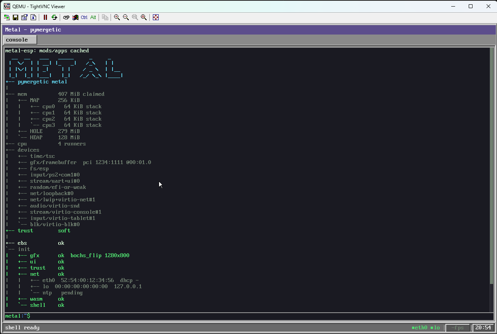
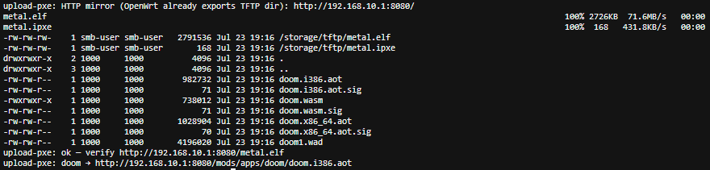
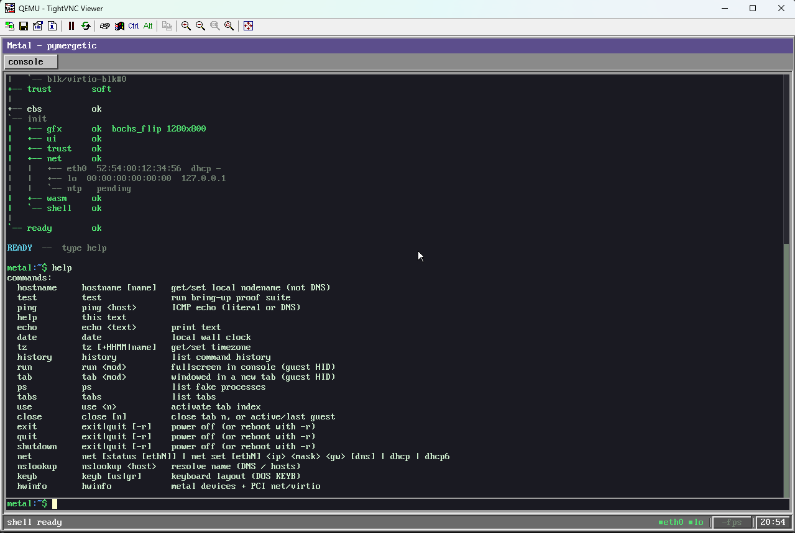
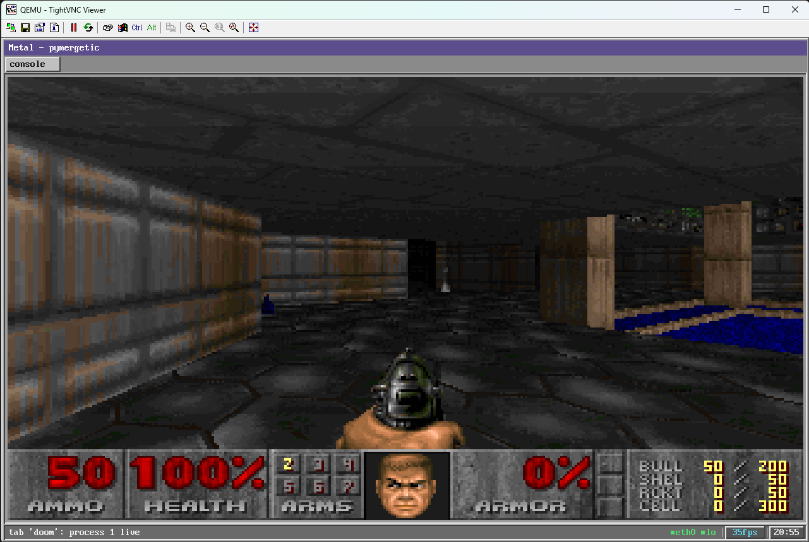
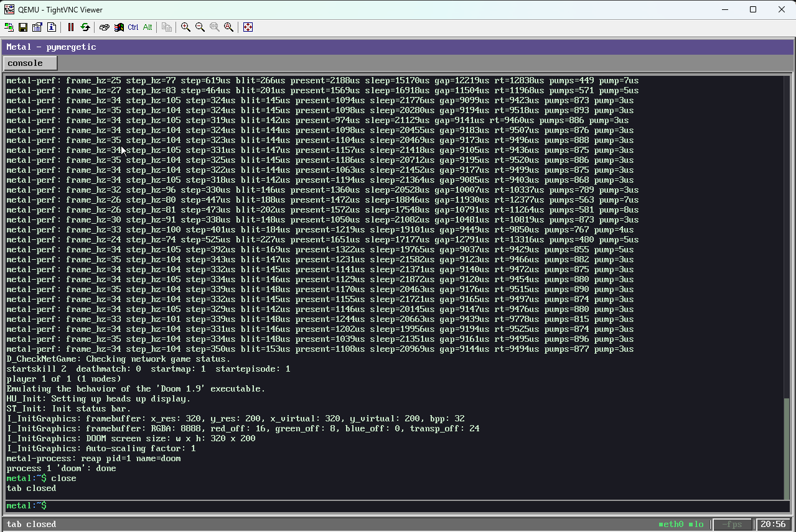
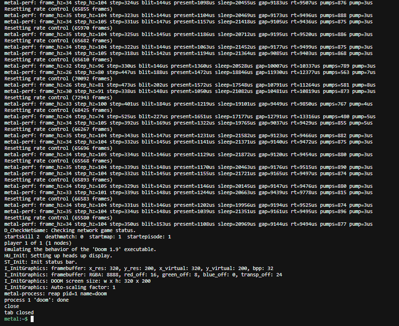
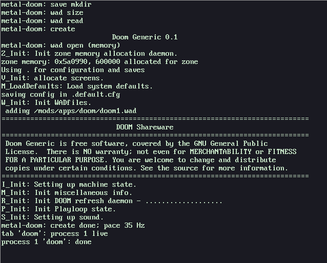
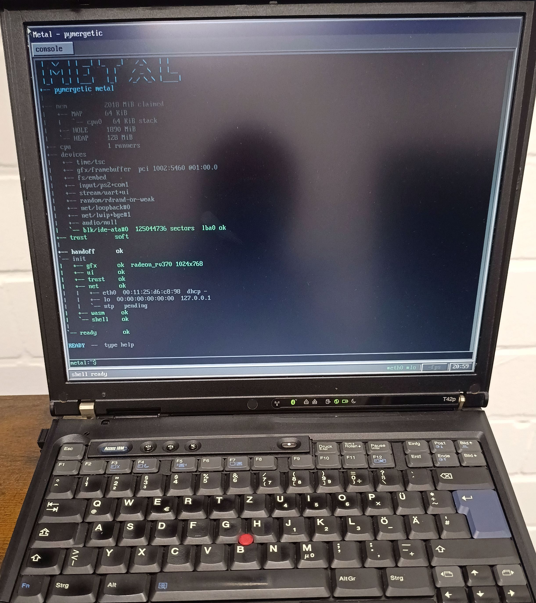
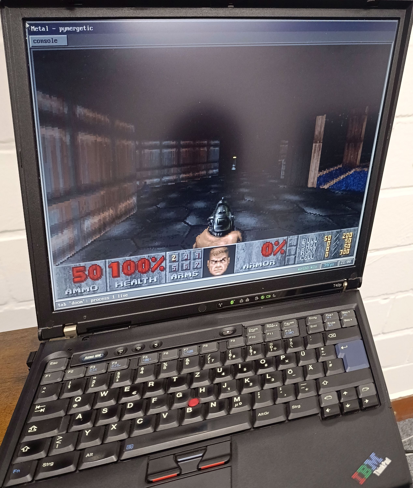

# Metal

Blank metal. Async wasm. High-speed APIs — almost nothing in the way.



- **Apps = `wasm32` guests** — `await` Metal APIs (present / net / FS / …) from
  `guest_step` via WASI-style imports
- **Host = thin async runtime** — UEFI or BIOS/PXE; **one runner per CPU**;
  exchangeable drivers; WAMR interp / AOT / (soon) JIT
- **Not** a hosted OS, **not** sync syscalls on a kernel
- Shell / tabs prove the machine is alive — they are **not** “the OS”
- **Doom** is here because it’s the classic “you’re an OS” proof (gfx, input,
  timing, packages) — not because Metal is a game console

**Blank metal → pull apps over the wire**

- Boot a thin image (PXE/BIOS or ESP) → DHCP lease
- **HTTP-fetch** signed `.wasm` / `.aot` (+ payload) from boot server
  (`next-server` / `:8080`)
- Detached ECDSA **`.sig`** (Mods CA; soft or enforce) → certified guests
- Iron can stay almost empty and still run Doom today  
  → [`TRUST.md`](docs/TRUST.md) · [`DOOM_ASYNC.md`](docs/DOOM_ASYNC.md)



- **Who:** not normal desktop users — *almost nothing* in the way; product is
  the high-speed awaitable ABI to wasm
- **Where:** virtual Metal (QEMU/KVM) first → **virtio**; old ThinkPad
  **T42p**/T43 as the fun path that keeps driver ops swappable

---

## Screenshots

| | |
|:-:|:-:|
|  |  |
| QEMU — boot / device tree | QEMU — `help` |
|  |  |
| QEMU — `tab doom` (~35 fps) | UI console after Doom |
|  |  |
| Host UART — same log as UI | UART — Doom create / 35 Hz pace |

| | |
|:-:|:-:|
|  |  |
| ThinkPad T42p — shell (`radeon_rv370`) | ThinkPad T42p — Doom tabbed |

More filenames: [`screenshots/README.md`](screenshots/README.md).

---

## Highlights

- **Bare metal + certified HTTP packages** — boot almost empty, DHCP, then pull
  signed wasm/AOT (and WAD/etc.) from the PXE/HTTP seed server; verify `.sig`
- **Async host** — Python-shaped coroutines (`await`, tasks, sleep/deadlines);
  **N CPUs → N equal runners** (FCFS, no CPU0 Extrawurst)
- **Wasm + async (preferred)** — guests `await` Metal imports from `guest_step`;
  `run` / `tab` / embed when already local
- **Gfx** — shadow FB + scanout backends (Bochs/QEMU, VESA, **Radeon RV370** GART+CP on ThinkPad T43, i915 sample); status tray with live present FPS
- **Net** — `lo` + `eth0`…; virtio-net + Broadcom **bge**; DHCPv4/v6, DNS, NTP, ping, TFTP/HTTP
- **I/O** — virtio-blk / IDE, virtio-snd → AC97 → null; PS/2 + tablet input
- **Shell / UI** — tabbed chrome, linker-section commands, serial + framebuffer consoles in parallel

Deep dives: [`docs/IO.md`](docs/IO.md) · [`docs/LIBC_ASYNC.md`](docs/LIBC_ASYNC.md) · [`docs/DOOM_ASYNC.md`](docs/DOOM_ASYNC.md)

---

## Wasm guests: interp · AOT · JIT

| Mode | Status | Notes |
|------|--------|--------|
| **Interpreter** | Shipped | WAMR classic / fast interp — always available fallback |
| **AOT** | Shipped | Offline `wamrc` → `.x86_64.aot` / `.i386.aot`; preferred when present (Doom ships both) |
| **Fast JIT** | Gap → coming | WAMR Fast JIT (x86-64 only); needs asmjit + freestanding C++ link — see [`docs/FAST_JIT.md`](docs/FAST_JIT.md) |

Load order today: matching **AOT** for the host arch, else **`.wasm`** (interp).
JIT will close the “ship wasm only, still fast on x64” gap; **i386 BIOS** stays
interp/AOT (no upstream Fast JIT backend).

---

## Quick start

```bash
./scripts/setup edk2         # once — EDK2 + nasm + BaseTools
./scripts/build efi          # → build/efi/metal.efi
./scripts/verify efi         # QEMU + OVMF smoke
./scripts/run efi --gtk      # interactive (optional)
```

BIOS / PXE (i386 iron, e.g. ThinkPad):

```bash
./scripts/build bios i386
# optional Doom package on the PXE tree:
METAL_DOOM_BUILD=1 ./scripts/upload-pxe --build
```

In the shell: `help`, `tab doom`, `run doom`. More: [`docs/EFI.md`](docs/EFI.md), [`docs/DOOM_ASYNC.md`](docs/DOOM_ASYNC.md).

---

## Documentation

| Doc | What |
|-----|------|
| [docs/IO.md](docs/IO.md) | Async I/O classes, device table, runners |
| [docs/LIBC_ASYNC.md](docs/LIBC_ASYNC.md) | Guest libc ↔ async ABI |
| [docs/DOOM_ASYNC.md](docs/DOOM_ASYNC.md) | Doom package, pace, present path |
| [docs/FAST_JIT.md](docs/FAST_JIT.md) | Fast JIT bring-up brief (not enabled yet) |
| [docs/TRUST.md](docs/TRUST.md) | Mod signing / trust modes |
| [docs/WASI.md](docs/WASI.md) | WASI preview1 surface |
| [docs/RUNTIME.md](docs/RUNTIME.md) | Load / process model |
| [docs/COOP_MEMORY.md](docs/COOP_MEMORY.md) | Per-CPU TLSF + SHARED typed alloc |
| [docs/LAYERS.md](docs/LAYERS.md) | Stack sketch (some hosted-era notes remain) |
| [docs/SOURCETREE.md](docs/SOURCETREE.md) | Tree layout |
| [docs/TODO.md](docs/TODO.md) | Living follow-ups / iron smoke |
| [src/efi/README.md](src/efi/README.md) | EFI package entrypoints |

---

## Layout

```
packages/metal/
├── include/pymergetic/metal/   public Metal ABI (gfx, async, net, ui, …)
├── src/pymergetic/metal/      host: boot, bus, dev, guest/wasm, shell, runtime
├── src/efi/                   UEFI MetalPkg
├── mods/tests/                harness .wasm guests
├── mods/apps/                 apps (doom, …)
├── screenshots/               UI / UART / Doom / iron photos
├── docs/                      design + bring-up notes
└── scripts/                   setup | build | verify | run | upload-pxe
```

---

## Status

Actively developed against **QEMU** (virtio / Bochs) and **ThinkPad-class iron**
(BIOS i386 + Radeon present path). Expect sharp edges; see [`docs/TODO.md`](docs/TODO.md).

### Next: Python

After Doom, next guest is **Python**. **Preferred path stays wasm + async
Metal ABI** (same as Doom). Still open: **CPython vs MicroPython**, and whether
a spike ever justifies a direct host embed instead — check memory/async fit
before deciding. Tracked in [`docs/TODO.md`](docs/TODO.md).

---

## License

Metal is **[Apache License 2.0](LICENSE)** unless a file says otherwise.

Third-party / vendored bits keep their own terms (e.g. FreeBSD **bge**
BSD-4-Clause under `src/pymergetic/metal/dev/net/bge/freebsd/`; WAMR, Doom,
EDK2, etc. under `external/` or their upstream licenses).
