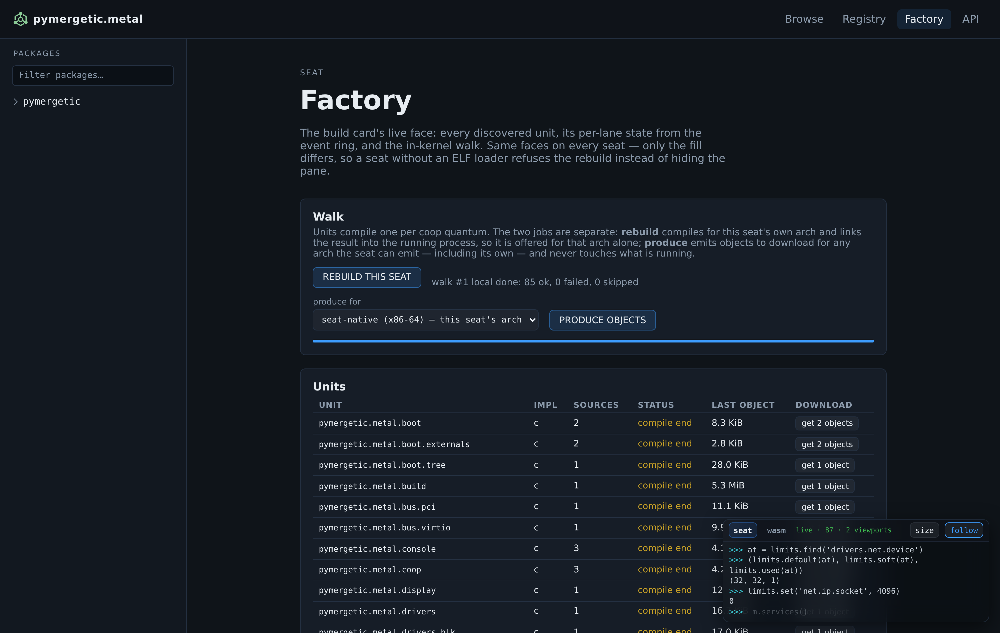
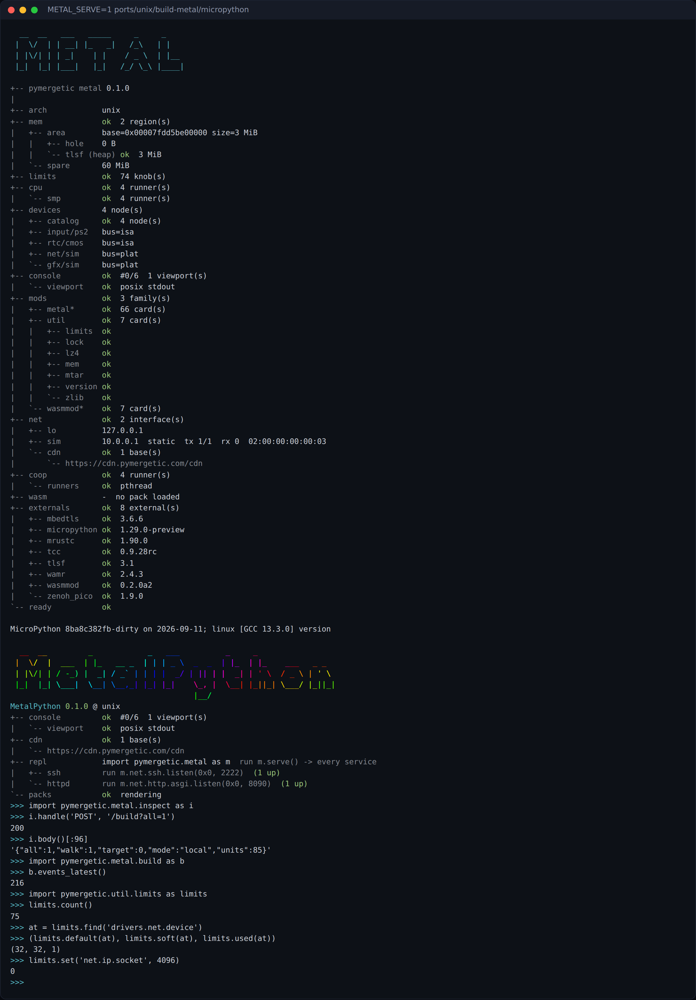
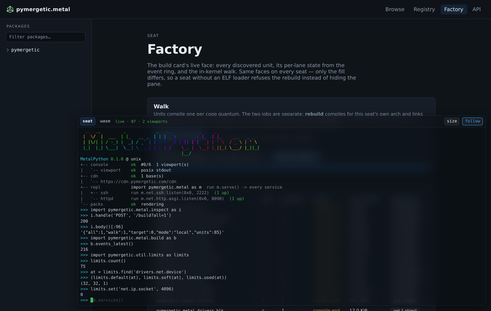

# Metal

`pymergetic.metal` — async host, replaceable drivers, wasm + MicroPython
guests. Nested at metalpython `extmod/metal`. Heap is wasmmod
`pymergetic.util.mem`. There is no `pymergetic.metal.mem`.

**Boot → drivers → IP → fetch packs → go.** One card face on every seat
(host C, unix µPy, emcc, firmware BIOS/UEFI). A fill may differ (`io.fetch`
is POSIX, metal park, or `js.fetch`); the module does not.

```bash
make -C extmod/metal menu          # tree × seat × mode
make -C extmod/metal help          # print the matrix
make -C extmod/metal prove-all     # mp only: host + QEMU prove + unix + emcc; no run
```

One `pm_metal_boot()` on every mp seat: feed memmap (or a hosted span) →
arena → cards → probe → NICs → the C tree. Unix/emcc fill mmap/`js.fetch`;
BIOS/UEFI fill e820/EFI + virtio; RV1106 fills DRAM. Prove extras (blk
read, unbind) stay in board `main`, not in boot. Firmware GC is off. Do
not auto-listen ASGI on unix boot.

Regen faces: `make -C extmod/metal gen`.

## The seat builds itself

The compilers are cards: `jit.c` (TCC, with its own wasm32 backend), `jit.cpp`
(C++ lowered to C), `jit.py` (µPy bytecode) and `jit.rs` (micro-rustc). The
`build` card drives them — `discover`, `unit_parse`, `unit_compile`, `link`,
an object store, an ELF relocator, a change ledger — so a card is recompiled
**by the seat running it** and the object linked into the live process. Two
jobs, kept apart: **rebuild** compiles for this seat's own arch and links the
result in; **produce** emits objects for any arch the seat can emit and never
touches what is running.

```bash
make -C extmod/metal ksweep      # every card through discover -> unit_compile
make -C extmod/metal selfhost    # micro-rustc's fixed point, in eight stages
```

`ksweep` is the readiness map (currently **85/85** cards compiled in-kernel;
refusals would name the next backend seam, not fail the build). `selfhost` is
the loop that matters: boot's rustc compiles `__impl__.rs` to C (gen-1), `cc`
builds a compiler from that, that compiler compiles `__impl__.rs` again
(gen-2), and **gen-2 must equal gen-1 byte for byte**. Then the same C goes
through the kernel's own TCC card, the object is linked by the build card's
relocator, and the *linked* compiler's output is compared against gen-1 again
— Rust → C → object → link → run, with no host `cc` in the last two stages.
The C++ card does the same with its own `__impl__.c`.
`tools/selfhost_cycle.sh` is the single source of truth for the stages.

## The UI the seat serves

`m.serve()` brings up httpd on `:8090` and ssh on `:2222` and the host mirror
that makes them reachable; the pages are built into the image by
`tools/embed_www.py` and every number on them is fetched from the seat's own
JSON. One pane per question: **Browse** for the card catalog, **Registry** for
what actually registered and which faces are missing, **Factory** for the
build floor.

<p>
  
</p>

The panel in the corner of every page is not a second REPL: it is console 0,
the same ring the terminal writes to, read with `GET /console/<id>?since=`
and written with `POST /console/exec?cmd=`. So `BUILD ALL` typed at the
terminal shows up in the browser, and a line typed in the browser runs on the
seat.

<p>
  
</p>

```python
>>> import pymergetic.metal.inspect as i
>>> i.handle("POST", "/build?all=1")        # the walk the Factory pane shows
200
>>> i.body()[:96]
'{"all":1,"walk":1,"target":0,"mode":"local","units":85}'
```

<p>
  
</p>

More stills, and how to refresh them: [`screenshots/`](screenshots/).

## Capacity is a knob

Every count a card used to fix in a header is a knob from
`pymergetic.util.limits`: a soft value it grows to, a hard one it may never
pass, the default it shipped with. Zero in either means no ceiling, software
moves the soft while running and can only lower the hard, and the value lives
in the card that uses it — read off the hot path, whole before `main`. Sockets,
connections, routes, console lines, build slots, every device table and the
class tables above them are taken this way, which is why a board's `.bss` is
1.44 MB rather than ~90 MB.

```python
>>> import pymergetic.util.limits as limits
>>> at = limits.find("drivers.net.device")
>>> (limits.default(at), limits.soft(at), limits.used(at))
(32, 32, 1)
>>> limits.set("net.ip.socket", 4096)
0
```

## Cards

| Layer | Module | What |
|-------|--------|------|
| dt / bus | `dt`, `bus.pci`, `bus.virtio` | inventory, PCI, virtio MMIO |
| drivers | `drivers`, `.net`, `.blk`, `.rtc` | bind / unbind |
| NIC | `drivers.net.virtio` | virtio-net (firmware MMIO; host in-process vq) |
| NIC | `drivers.net.sim` | in-process Ethernet (emcc `library.js` frames) |
| NIC | `drivers.net.tap` | linux TAP; other seats compile, open is a no-op |
| NIC | `drivers.net.bge` | Broadcom class probe + queues |
| NIC | `drivers.net.gmac` | dwmac-4.20a RMII (RV1106); other seats fail closed |
| blk / rtc | `blk.virtio`, `blk.ide`, `rtc.cmos`, `rtc.sim` | virtio-blk, ram IDE, CMOS / sim clock |
| async | `async` | stackless ready-ring + timers + `run_until` |
| ip | `net.ip` | IPv4 ICMP/UDP/TCP; lo; L2 rexmit after `sim_drop` |
| tls / http | `net.tls`, `net.http` | mbedtls records; parked `io.fetch` |
| asgi | `net.http.asgi` | RS HTTP/1.0 listen (one socket) |
| L7 | `dns`, `ntp`, `dhcp`, `tftp`, `ssh`, `wg` | A / SNTP / DISCOVER / RRQ / SSH ident / Noise_IK |
| fw | `fw.memmap` | firmware memory map |
| µPy | `register_upy` | bind a guest generator |

`make -C extmod/metal test` / `prove-all` is **mp** host C, then firmware
prove (QEMU greps, RV1106 link), then unix, then emcc. No REPL, no Luckfox
flash. `./menu.sh prove-all` is the same idea across **upy + upywm + mp**.
It never uploads (no TFTP, no Luckfox Maskrom).

## Seats

Tree × seat. Same Python/C face; fill may differ. `upy` is vanilla µPy,
`upywm` is wasmmod without metal, `mp` is metalpython.

| | unix | emcc | bios | uefi | rv1106 | cards |
|--|------|------|------|------|--------|--------|
| upy | bpr | bp | — | — | — | — |
| upywm | bpr | bp | — | — | — | — |
| mp | bpr | bp | bpru | bpru | bpru | bp |

`cards` is the metal C binary (`metal-async-test`), no µPy. Only **mp**
has `extmod/metal`. upywm is wasmmod without metal, so that cell stays empty.

`b` build  `p` prove  `r` run  `u` upload. QEMU serial grep is **prove**;
interactive serial is **run**. **upload** puts the image on iron: BIOS/UEFI
to the TFTP/BOOTP host (`METAL_PXE_HOST`, OpenWrt-style `tar|ssh` into
`METAL_PXE_PATH`), RV1106 Maskrom (`LUCKFOX_IP`, `RKBIN`, `RKTOOLS`). RV1106
`run` is the same burn as `upload`. `prove-all` never uploads.

```bash
./menu.sh prove mp unix
./menu.sh run mp bios
./menu.sh upload mp bios
./menu.sh prove-all
```

Boards: `X86_64_BIOS`, `X86_64_UEFI`, `ARMV7_RV1106` (Luckfox Pico Max).
There is no 32-bit x86 board: a seat needs its own toolchain, not a 64-bit
image copied to `BOOTIA32.EFI`.

Env (never baked into the tree): `EMSDK`, `RKBIN`, `RKTOOLS`,
`LUCKFOX_IP`, `LUCKFOX_ETHADDR`, `METAL_PXE_HOST`, `METAL_PXE_USER`,
`METAL_PXE_PATH`, `METAL_PXE_SSH_OPTS`. QEMU CDN uses SLIRP `10.0.2.2`
(QEMU’s host gateway, not a LAN). DHCP NBP stays `undionly.kpxe` /
`ipxe.efi`; `metal.ipxe` / `metal-efi.ipxe` chain the uploaded payload.

---

Doom / the old CMake runtime: [`preview`](https://github.com/pymergetic/metal/tree/preview).
