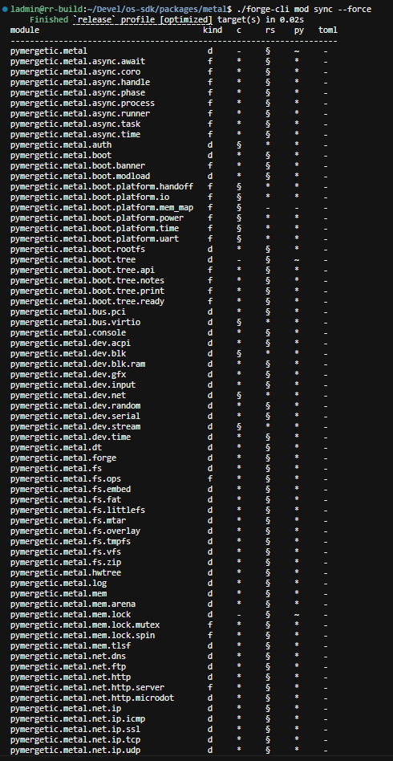

# Metal

Freestanding Metal firmware under [`src/pymergetic/metal/`](src/pymergetic/metal/).

```bash
git submodule update --init --recursive
./forge-cli build bios    # or efi | all
./forge-cli run bios
```

Tooling detail + roadmap: [`docs/TOOLING.md`](docs/TOOLING.md).

## Layout

| Path | Role |
|------|------|
| `src/pymergetic/metal/` | Firmware + forge module |
| `config/` | Kconfig (local `.config` gitignored) |
| `build/` | Forge outputs (gitignored) |
| `external/` | Submodules — lwip, tlsf, monocypher, mbedtls (forge does not download) |
| `forge-cli` | Autobuild launcher for hidden `forge/cli` |
| `docs/` | Live design + tooling docs |
| `_old/` | Archived product tree, scripts, patches, Python metal |

## Modules

Lang-pool inventory from `./forge-cli mod sync`
(`§` original, `*` emitted, `~` marker, `-` noop; `d`/`f` = package entry / sibling).
Details: [`docs/definitions/module.md`](docs/definitions/module.md).



## Docs

| Doc | Role |
|-----|------|
| [`docs/TOOLING.md`](docs/TOOLING.md) | Front door + roadmap |
| [`docs/SOURCETREE.md`](docs/SOURCETREE.md) | Tree + C dialect |
| [`docs/PLATFORM.md`](docs/PLATFORM.md) | BIOS/EFI ops floor |
| [`docs/KCONFIG.md`](docs/KCONFIG.md) | `forge config` |
| [`docs/definitions/`](docs/definitions/) | Module / fs / async |

Also: [`EFI.md`](docs/EFI.md), [`IO.md`](docs/IO.md), [`MEMORY.md`](docs/MEMORY.md),
[`COOP_MEMORY.md`](docs/COOP_MEMORY.md), [`LIBC_ASYNC.md`](docs/LIBC_ASYNC.md),
[`MODS.md`](docs/MODS.md), [`HELLO_SLICE.md`](docs/HELLO_SLICE.md).
Product-only papers (µPy, mount, WASI, …) stay under [`_old/docs/`](_old/docs/).
