# Metal

Blank metal. Async wasm + MicroPython. High-speed awaitable APIs — almost
nothing in the way.

> **Experimental / alpha.** Early preview, not a product release. APIs move,
> drivers are incomplete, docs lag, iron is “works on *my* ThinkPad.” Fun and
> real — not polished, not supported, not something to bet a deployment on.
> In the os-sdk monorepo this is the **first bottom-up recomposition** focus
> after top-down exploration. Bring curiosity; bring patches; don’t bring
> production expectations.

**Boot → hardware → CPU runners → certified guests → go.**

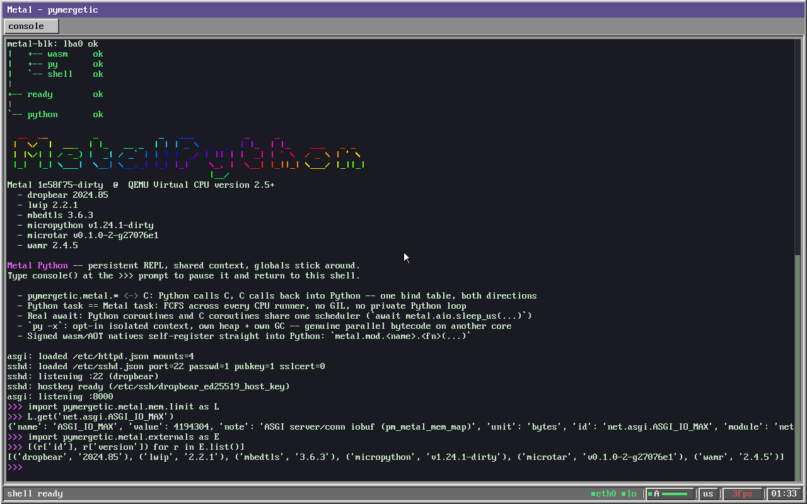

- **Guests = `wasm32` mods + MicroPython** — mods `await` Metal via WASI-style
  imports ([`docs/MODS.md`](docs/MODS.md)); Python is in-core (REPL default,
  host↔guest binds) — [`docs/MICROPYTHON.md`](docs/MICROPYTHON.md)
- **Host = thin async runtime** — UEFI or BIOS/PXE; **one runner per CPU**;
  exchangeable drivers; WAMR interp / AOT / (soon) JIT
- **Not** a hosted OS, **not** sync syscalls on a kernel
- Shell / tabs / HTTP / SSH prove the machine is alive — they are **not**
  “the OS”
- **Introspection is live** — compile-time budgets (`limits` /
  `pymergetic.metal.mem.limit`), third-party stack ids (`externals`), kernel
  `about`, plus DOC/IFACE catalogs over HTTP (`/limits`, `/externals`,
  `/docs`, `/iface`, `/api/...`)
- **Proofs, not the product:** Doom (gfx/input/timing/packages), ASGI doc UI,
  Dropbear SSH — classic “you’re an OS” demos on a blank-metal awaitable ABI

**Blank metal → pull apps over the wire**

- Boot a thin image (PXE/BIOS or ESP) → DHCP lease
- **HTTP-fetch** signed `.wasm` / `.aot` (+ payload) from boot server
  (`next-server` / `:8080`)
- Detached ECDSA **`.sig`** (Mods CA; soft or enforce) → certified guests
- Iron can stay almost empty and still run Doom today (external app,
  [`packages/metal-doom`](https://github.com/pymergetic/metal-doom))
  → [`TRUST.md`](docs/TRUST.md) · [`metal-doom/docs/DOOM_ASYNC.md`](https://github.com/pymergetic/metal-doom/blob/main/docs/DOOM_ASYNC.md)

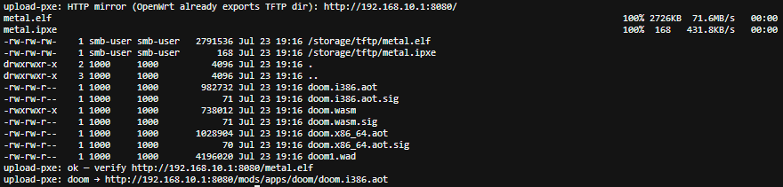

- **Who:** not normal desktop users — *almost nothing* in the way; product is
  the high-speed awaitable ABI (wasm + Python faces)
- **Where:** virtual Metal (QEMU/KVM) first → **virtio**; old ThinkPad
  **T42p**/T43 as the fun path that keeps driver ops swappable

---

## Screenshots

| | |
|:-:|:-:|
|  | 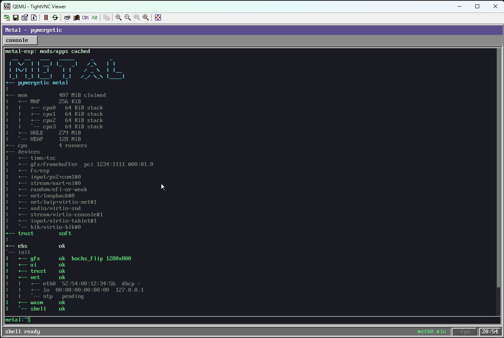 |
| QEMU — REPL: `mem.limit` + `externals` | QEMU — boot / device tree |
| 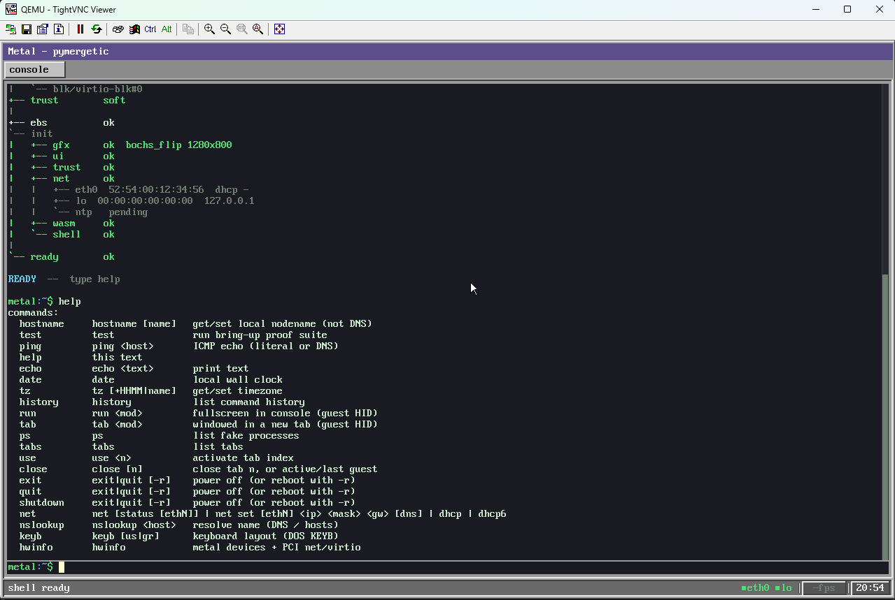 | 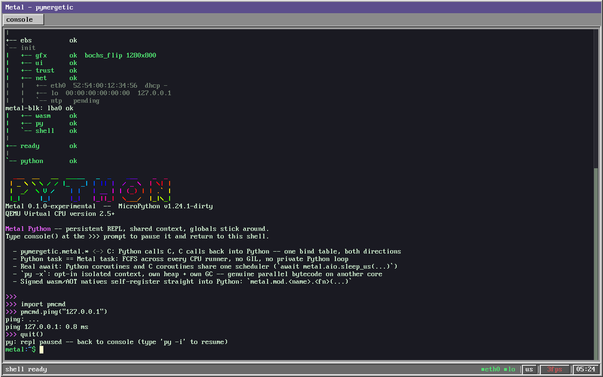 |
| QEMU — `help` | QEMU — REPL banner + `pmcmd.ping` |
| 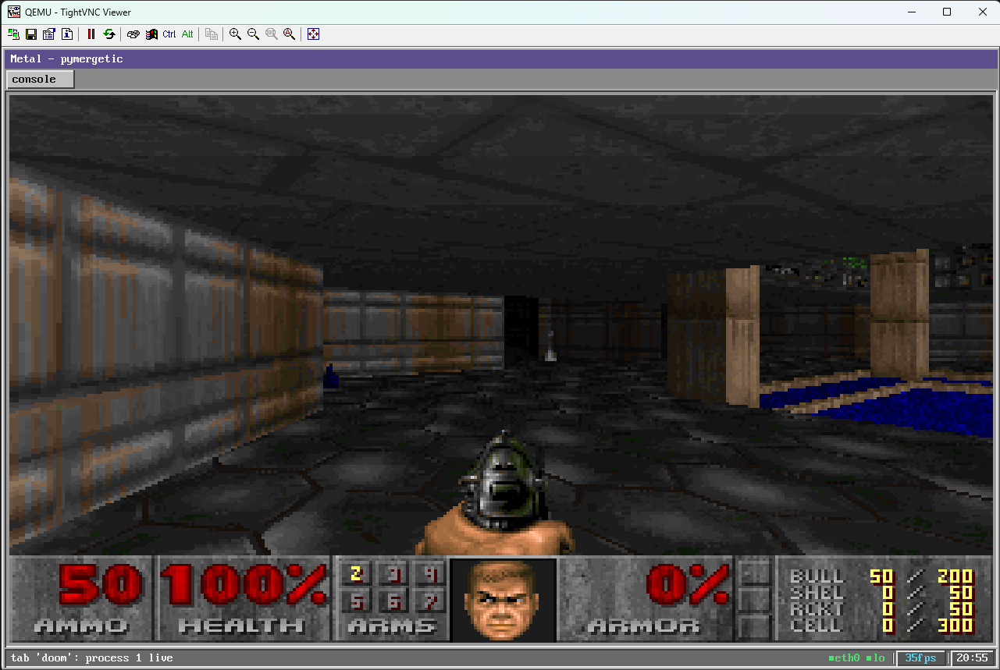 | 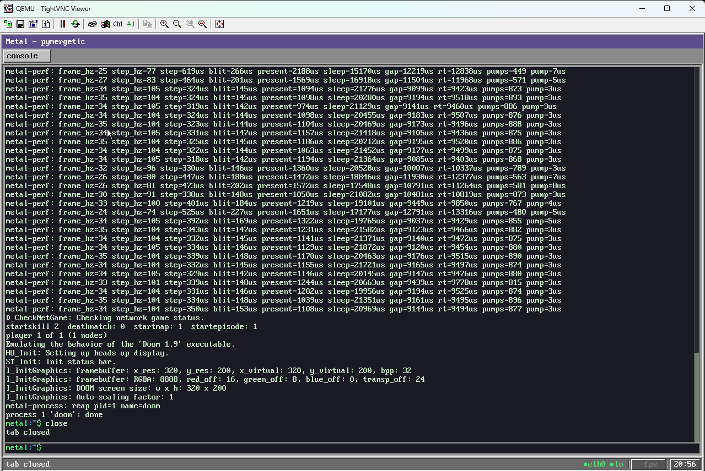 |
| QEMU — `tab doom` (~35 fps) | UI console after Doom |
| 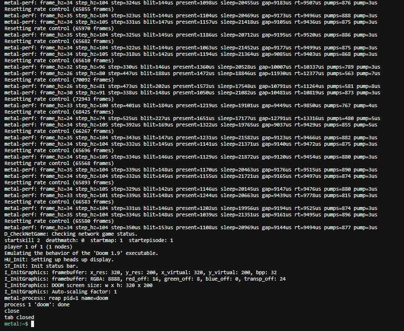 | 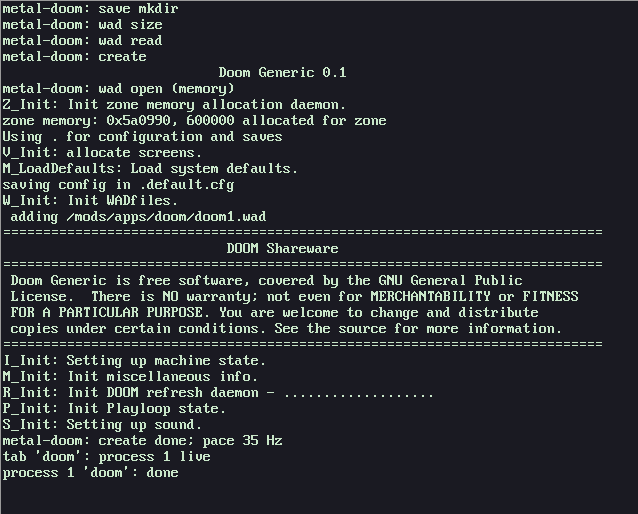 |
| Host UART — same log as UI | UART — Doom create / 35 Hz pace |

| | |
|:-:|:-:|
| 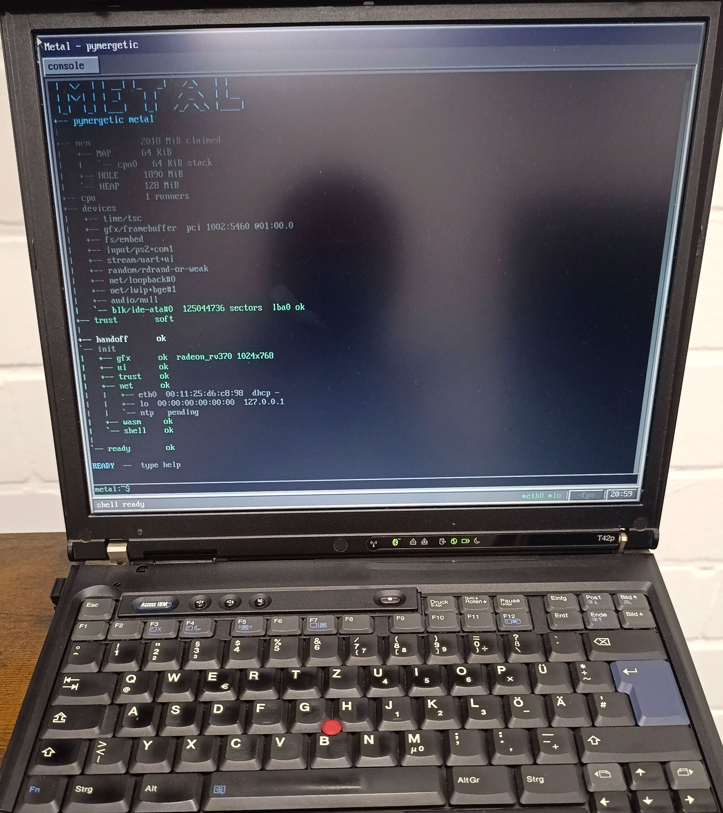 | 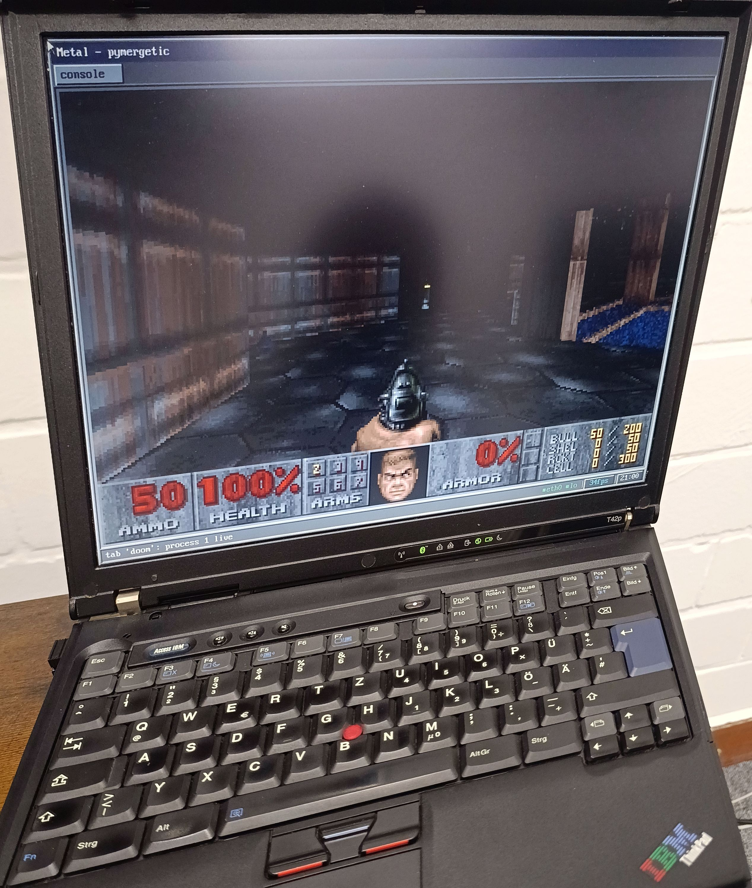 |
| ThinkPad T42p — shell (`radeon_rv370`) | ThinkPad T42p — Doom tabbed |

More filenames: [`screenshots/README.md`](screenshots/README.md).

---

## Highlights

- **Bare metal + certified HTTP packages** — boot almost empty, DHCP, then pull
  signed wasm/AOT (and WAD/etc.) from the PXE/HTTP seed server; verify `.sig`
- **Async host** — Python-shaped coroutines (`await`, tasks, sleep/deadlines);
  **N CPUs → N equal runners** (FCFS, no CPU0 Extrawurst)
- **Wasm + async (preferred)** — mods `await` Metal imports from registered
  callables; shell `run` / `tab` / bare cmd invoke processes
- **Gfx** — shadow FB + scanout backends (Bochs/QEMU, VESA, **Radeon RV370** GART+CP on ThinkPad T43, i915 sample); status tray with live present FPS
- **Net** — `lo` + `eth0`…; virtio-net + Broadcom **bge**; DHCPv4/v6, DNS, NTP, ping, TFTP/HTTP
- **I/O** — virtio-blk / IDE, virtio-snd → AC97 → null; PS/2 + tablet input
- **Shell / UI** — tabbed chrome, linker-section commands, serial + framebuffer consoles in parallel
- **MicroPython in core** — one always-on blob, N equal runners, no GIL; boots
  straight into a persistent **REPL** (system's default shell, C console one
  `console()` away); host ↔ guest bidirectional calls; ~25-module Easy
  stdlib under `/mods/py/stdlib` (`time`/`datetime`, `hashlib`, `re`, …);
  opt-in isolated contexts for true parallel bytecode (own heap, no shared lock)
- **Net services** — ASGI HTTP (C / MicroPython / wasm leaves on one listener),
  Dropbear SSH as another viewport on the shared console
- **Catalogs** — DOC/IFACE (callable help + WASI syms), **externals** (vendored
  stack identity), **mem limits** (compile-time buffer budgets) — shell, Python,
  WASI, and `/api/...` share one authority each ([`docs/IFACE.md`](docs/IFACE.md),
  [`docs/IO.md`](docs/IO.md))

### ASGI httpd — one listener, many backends

C owns the wire; mounts point at opaque `app_h` leaves. Longest-prefix match,
then dispatch by runner kind (`C` / `PY` / `WASM`). Host and guest both call
`pm_metal_net_asgi_mount`; wasm apps self-register (`register_wasm`) before
mounting. Builtins for `/etc/httpd.json`: `c:health`, `c:static`, `py:httpd`
— see [`docs/IO.md`](docs/IO.md).

| Dispatch | Config |
|:---:|:---:|
|  | 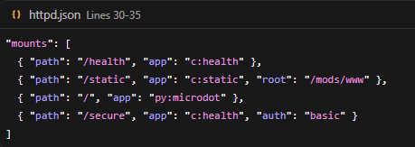 |
| `asgi_server.c` — mount → C / Py / wasm | `mods/etc/httpd.json` — path → app |

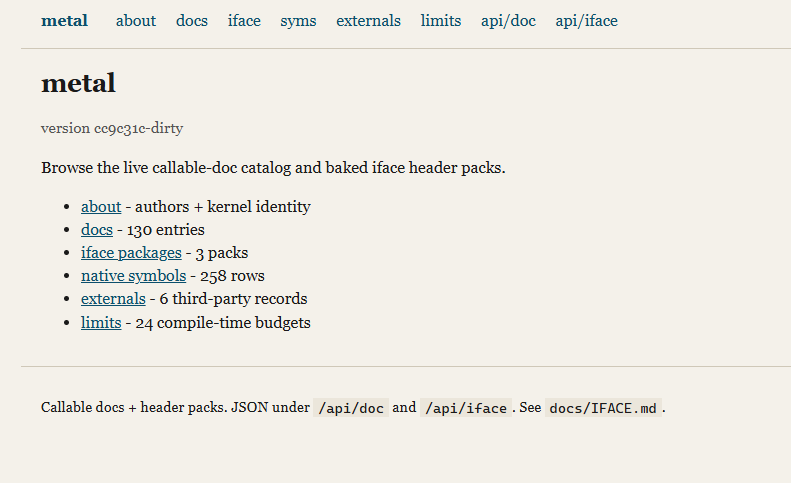

ASGI/microdot home (`/`) — live counts for docs, iface packs, native syms,
externals, and limits. Same authority as the shell/Python/WASI faces.

| Externals | Limits |
|:---:|:---:|
| 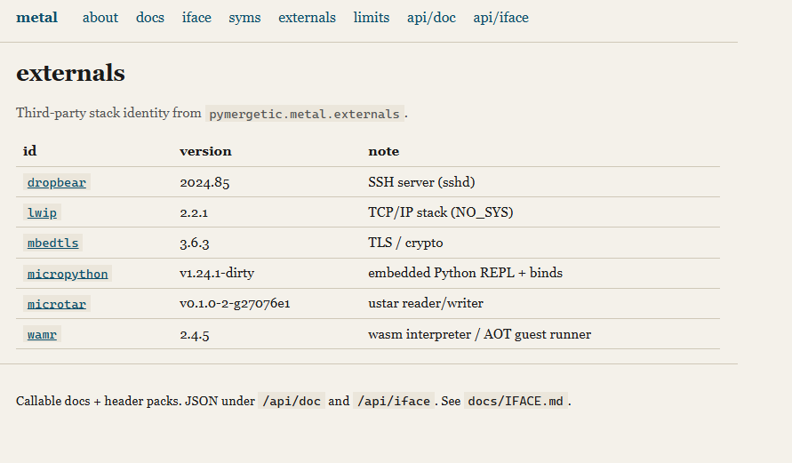 | 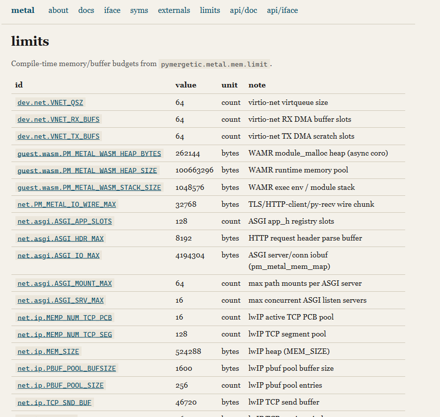 |
| `/externals` — vendored stack ids | `/limits` — compile-time buffer budgets |

Same registries as shell `externals` / `limits` and
`pymergetic.metal.externals` / `pymergetic.metal.mem.limit` (see
[`docs/IO.md`](docs/IO.md)).

Deep dives: [`docs/KCONFIG.md`](docs/KCONFIG.md) · [`docs/IO.md`](docs/IO.md) · [`docs/LIBC_ASYNC.md`](docs/LIBC_ASYNC.md) · [`metal-doom/docs/DOOM_ASYNC.md`](https://github.com/pymergetic/metal-doom/blob/main/docs/DOOM_ASYNC.md) · [`docs/MICROPYTHON.md`](docs/MICROPYTHON.md) · [`docs/IFACE.md`](docs/IFACE.md)

---

## Wasm guests: interp · AOT · JIT

| Mode | Status | Notes |
|------|--------|--------|
| **Interpreter** | Shipped | WAMR classic / fast interp — always available fallback |
| **AOT** | Shipped | Offline `wamrc` → `.x86_64.aot` / `.i386.aot`; preferred when present (`packages/metal-doom` ships both) |
| **Fast JIT** | Gap → coming | WAMR Fast JIT (x86-64 only); needs asmjit + freestanding C++ link — see [`docs/FAST_JIT.md`](docs/FAST_JIT.md) |

Load order today: matching **AOT** for the host arch, else **`.wasm`** (interp).
JIT will close the “ship wasm only, still fast on x64” gap; **i386 BIOS** stays
interp/AOT (no upstream Fast JIT backend).

---

## Quick start

```bash
./scripts/setup edk2         # once — EDK2 + nasm + BaseTools
./scripts/menuconfig         # optional — budgets / iface / default target (docs/KCONFIG.md)
./scripts/build efi          # → build/x86_64_efi/metal.efi  (argv overrides Kconfig for this call)
./scripts/verify efi         # QEMU + OVMF smoke
./scripts/run efi --gtk      # interactive (optional)
```

BIOS / PXE (i386 iron, e.g. ThinkPad):

```bash
./scripts/build bios i386
# optional external app on the PXE tree (e.g. packages/metal-doom):
METAL_EXT_APPS=doom=../metal-doom/build/doom ./scripts/upload-pxe --build
```

External app one-shot round-trip (runs the app's own `scripts/build.sh`,
then whichever of build/upload/run you ask for, on efi/bios/both — see
`scripts/ext-app --help`; short flags stack, e.g. `-bur` == `-b -u -r`):

```bash
./scripts/ext-app doom=../metal-doom -ber          # build + run efi
./scripts/ext-app doom=../metal-doom -beu          # build + upload efi (ESP, scripts/upload-efi)
./scripts/ext-app doom=../metal-doom -biu          # build + upload bios (PXE, scripts/upload-pxe)
./scripts/ext-app doom=../metal-doom -sa           # build+upload+run, efi+bios
./scripts/ext-app doom=../metal-doom -er --no-build -- --bench  # run efi only, headless
```

In the shell: `help`, `limits`, `externals`, `about`, `tab doom`, `run doom`.
REPL: `import pymergetic.metal.mem.limit as L` then `L.get('net.asgi.ASGI_IO_MAX')`.
More: [`docs/EFI.md`](docs/EFI.md), [`metal-doom/docs/DOOM_ASYNC.md`](https://github.com/pymergetic/metal-doom/blob/main/docs/DOOM_ASYNC.md).

---

## Kconfig

Compile-time budgets, iface embed toggles, and default build/upload/run live
in a small menuconfig tree under `config/` (mirrors `pymergetic.metal`
modules). Day to day:

```bash
./scripts/menuconfig   # TUI -> config/.config (+ confgen)
./scripts/build efi    # argv/env still override .config for one call
```

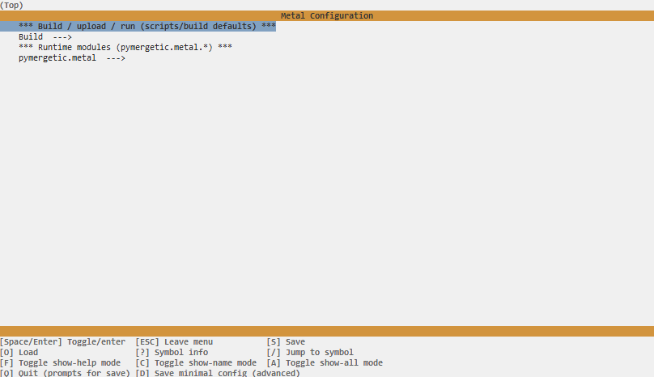

Sizes in the menu are KiB/MiB; `build/autoconf.h` gets byte `CONFIG_*` for C.
`oldconfig` only after you edit `Kconfig` files themselves. Details:
[`docs/KCONFIG.md`](docs/KCONFIG.md).

---

## Headers + sources (iface packs)

Build embeds named **`lz4(ustar)`** packs the guest can browse at runtime
(`pymergetic.metal.iface` / shell `iface` / HTTP `/iface` + `/api/iface`).
Toggle under menuconfig → **pymergetic.metal → util → iface**:

| Pack | Kconfig (default) | Kind |
|------|-------------------|------|
| `h@metal.guest` | `EMBED_C_HEADERS` **y** | `h` — public ABI `.h` |
| `meta@metal.guest` / `meta@metal.guest.docs` | with C headers | `meta` |
| `c@metal.guest` | `EMBED_C_IMPL` **n** | `c` — full C/asm/h tree |
| `pyi@metal.guest` | `EMBED_PYTHON_HEADERS` **y** | `pyi` |
| `py@metal.guest` | `EMBED_PYTHON_IMPL` **y** | `py` — product `.py` |
| `py@metal.stdlib` | always (with C headers) | `py` — Easy stdlib, mandatory for µPy |
| `h@mod.t8_multimod_lib` | with C headers | `h` |

```text
# shell
iface                         # pack names: <kind>@<base>
iface ls h@metal.guest
iface cat py@metal.guest httpd/__init__.py
iface cat pyi@metal.guest pymergetic/metal/fs.pyi
iface sym                     # WASI NativeSymbol table (+ doc_key -> /docs)
```

```python
import pymergetic.metal.iface as iface
iface.info()                  # name -> {kind, version, nfiles, ...}
iface.read("py@metal.guest", "api/iface.py")
```

HTTP HTML: `/iface`, `/iface/pkg/...` (highlight by extension) — JSON:
`/api/iface*`. Full detail: [`docs/IFACE.md`](docs/IFACE.md).

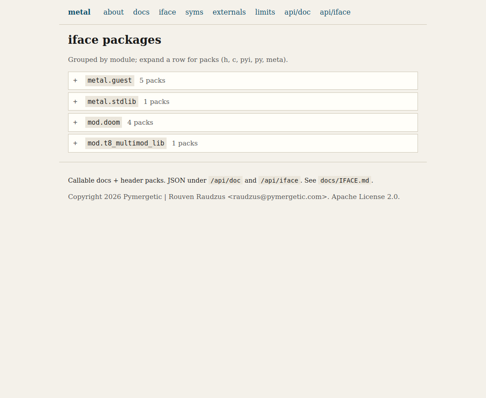

| C headers | C impl (opt-in) |
|:---:|:---:|
| 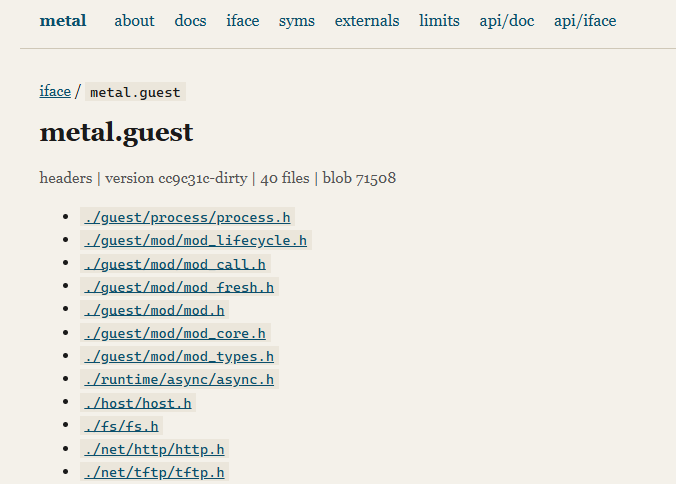 | 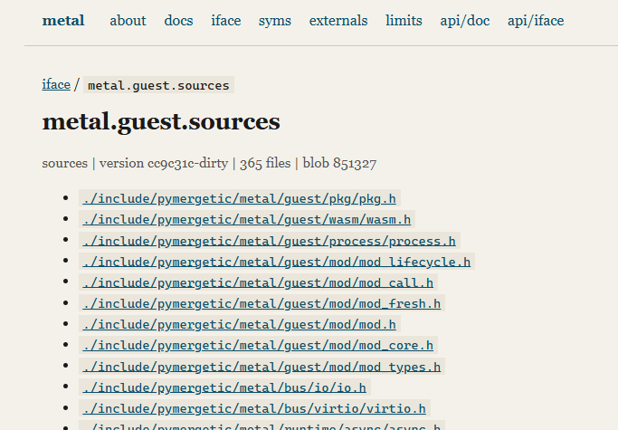 |
| `h@metal.guest` | `c@metal.guest` |

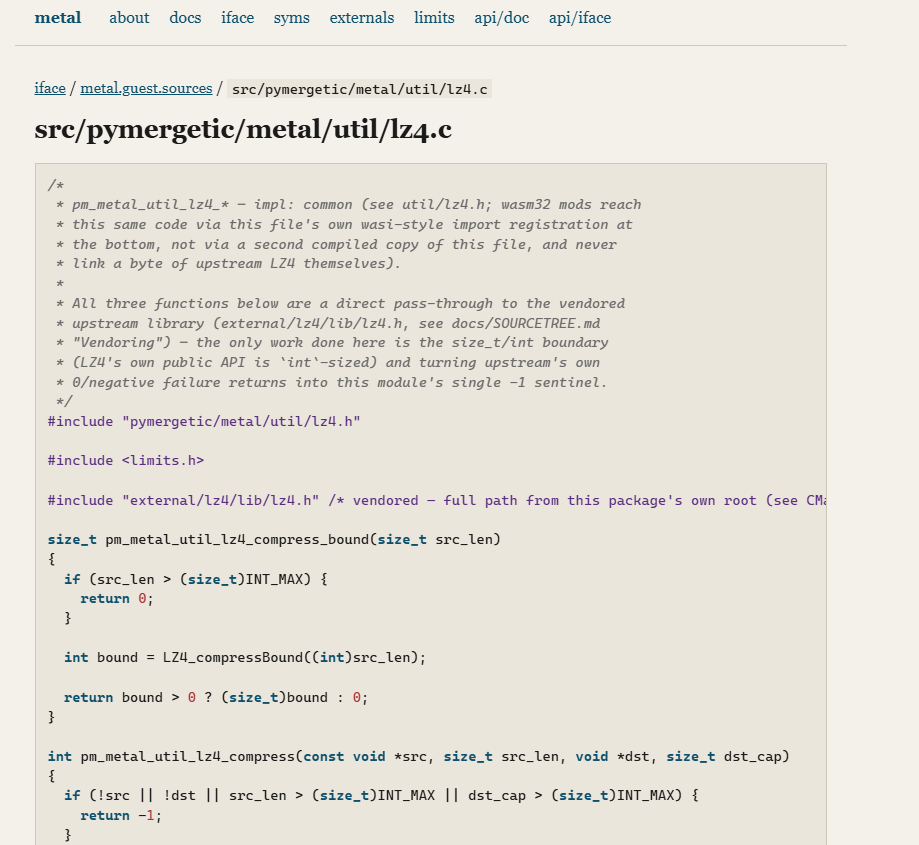

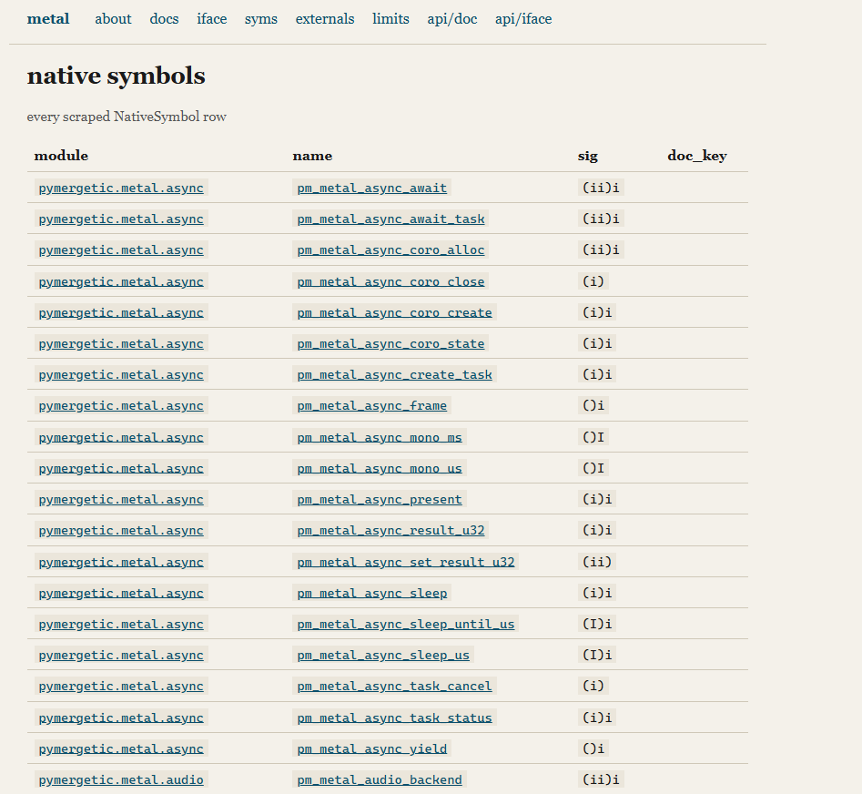

`/iface/sym` (shell `iface sym` / `iface.sym()`) lists every harvested
`NativeSymbol` row — module, name, WAMR `sig`, optional `doc_key` into `/docs`.

### Callable docs (`/docs`)

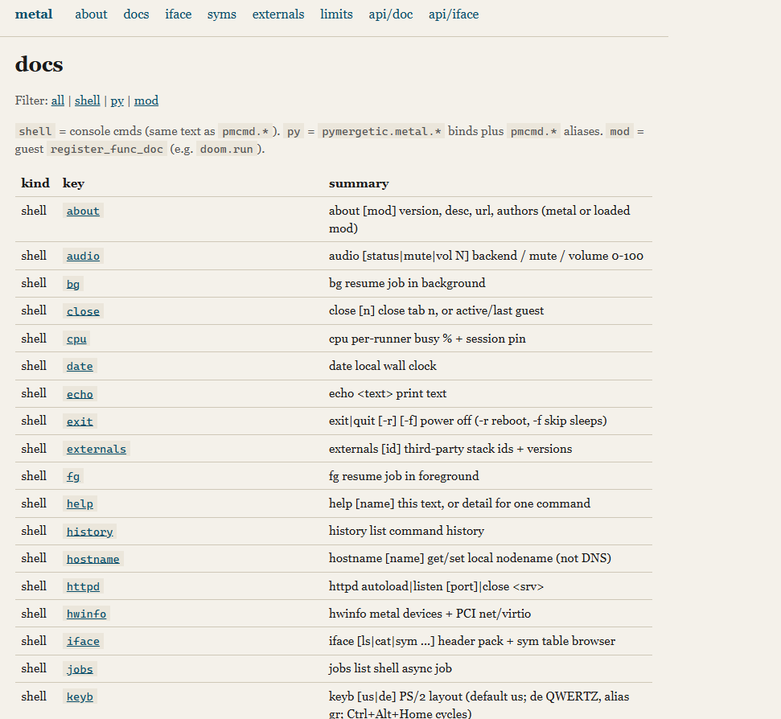

`/docs?kind=shell` — console cmds (same text as `pmcmd.*`). Filter also has
`py` (`pymergetic.metal.*` + `pmcmd.*` aliases) and `mod` (guest
`register_func_doc`).

### Live mod docs (`/docs?kind=mod`)

`kind=mod` stays empty until a package loads and calls
`register_func_doc` (`load` / `pmcmd.load` — or implicitly via `run`/`tab`).
Stage an external app first (`METAL_EXT_APPS=doom=../metal-doom/build/doom`).

| Before | Load | After |
|:---:|:---:|:---:|
| 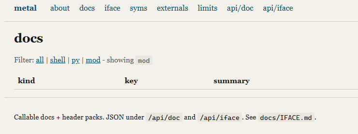 | 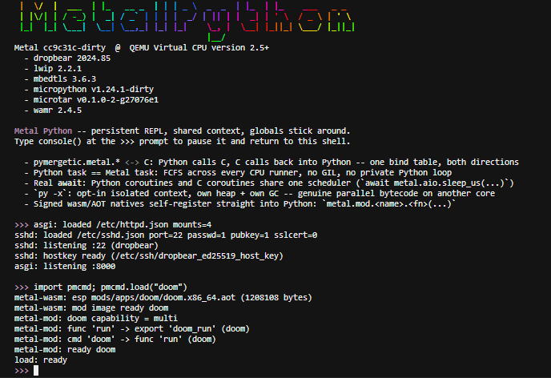 | 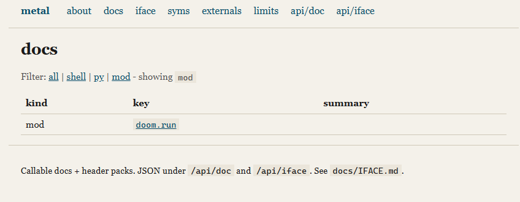 |
| `/docs?kind=mod` — no guests yet | `pmcmd.load("doom")` → ready | `doom.run` appears in the catalog |

---

## Documentation

Restored to live package [`../docs/`](../docs/) when still useful for exp2;
product-only papers stay in [`docs/`](docs/) here.

| Doc | What |
|-----|------|
| [../docs/KCONFIG.md](../docs/KCONFIG.md) | Kconfig / forge config (live) |
| [../docs/IO.md](../docs/IO.md) | Async I/O classes, device table |
| [../docs/LIBC_ASYNC.md](../docs/LIBC_ASYNC.md) | Guest libc <-> async ABI |
| [../docs/EFI.md](../docs/EFI.md) | UEFI owned-phase design |
| [../docs/COOP_MEMORY.md](../docs/COOP_MEMORY.md) | Per-CPU TLSF + SHARED typed alloc |
| [../docs/MEMORY.md](../docs/MEMORY.md) | Host/guest memory pools |
| [../docs/MODS.md](../docs/MODS.md) | Mod/command/process contract |
| [../docs/SOURCETREE.md](../docs/SOURCETREE.md) | Tree layout (live) |
| [docs/IFACE.md](docs/IFACE.md) | DOC/IFACE catalogs (archived product) |
| [docs/MICROPYTHON.md](docs/MICROPYTHON.md) | Kernel µPy (archived product) |
| [docs/MOUNT.md](docs/MOUNT.md) / [docs/RUNTIME.md](docs/RUNTIME.md) | Hosted-era plans |
| [docs/WASI.md](docs/WASI.md) / [docs/TRUST.md](docs/TRUST.md) / [docs/FAST_JIT.md](docs/FAST_JIT.md) | Product surfaces |
| [docs/LAYERS.md](docs/LAYERS.md) / [docs/TODO.md](docs/TODO.md) | Stack sketch / follow-ups |
| [src/efi/README.md](src/efi/README.md) | EFI package entrypoints |

---

## Layout

```
packages/metal/
├── include/pymergetic/metal/   public Metal ABI (gfx, async, net, ui, …)
├── src/pymergetic/metal/      host: boot, bus, dev, guest/wasm, shell, runtime
├── src/efi/                   UEFI MetalPkg
├── mods/tests/                harness .wasm guests
├── mods/apps/                 external apps staged here at build time (empty in a fresh checkout)
├── mods/py/                   MicroPython stdlib + py tests
├── mods/httpd/                ASGI package (import httpd) + Microdot/utemplate zips
├── mods/api/                  catalog routes + templates (docs/iface/…)
├── external/                  vendored trees (micropython, microdot, utemplate, …)
├── screenshots/               UI / UART / Doom / iron photos
├── docs/                      design + bring-up notes
├── scripts/                   setup | build | verify | run | upload-pxe | upload-efi | ext-app
└── build/                     (gitignored) arch_port product dirs:
      x86_64_efi/metal.efi
      x86_64_bios/{metal.elf,metal.qemu.elf}
      i386_bios/metal.elf
      pxe/                     iPXE + mods staging (kernel from i386_bios)
```

---

## Status

**Experimental / early.** Actively hacked against **QEMU** (virtio / Bochs) and
**ThinkPad-class iron** (BIOS i386 + Radeon present). Expect breakage, missing
paths, and TODOs — see [`docs/TODO.md`](docs/TODO.md). If it runs Doom on your
box, celebrate; if it doesn’t, that’s still on-brand for this stage.

### Python

**Landed, not a spike anymore.** One always-on MicroPython blob, N equal
runners, `await` Metal (no GIL); boot spawns a persistent, **interactive
REPL task** on that blob as the system's default shell (`console()` drops back
to the C command shell, never deleted). `py <script>` / `py -c` spawn more
**tasks** on the same engine — not a new VM. Host ↔ guest calls are
bidirectional (`pymergetic.metal.*` → C, and C → Python callables), loose
`/mods/py/stdlib` (iface `py@metal.stdlib`) ships ~25 pure-Python modules plus
`time`/`datetime`/`hashlib`/`re`/`tarfile`/`pymergetic.metal.tls` and friends,
and opt-in **isolated contexts** give genuine parallel bytecode (own heap,
own GC nursery, no shared run-lock) alongside the shared/serialized default.
Design + status: [`docs/MICROPYTHON.md`](docs/MICROPYTHON.md).

---

## Contributing

This is already a wide surface (boot, runners, drivers, wasm, net, UI…) and it
only gets bigger. **Help is welcome** — especially if you bring hardware,
driver patches, guest apps, docs, or brutal API feedback.

- Open an issue before a huge redesign (async ABI / scanout contracts matter)
- Small, reviewable PRs beat epic branches
- QEMU first is fine; iron reports are gold
- Keep the vibe: thin host, awaitable APIs, exchangeable drivers — not “port Linux”

No CLA drama beyond Apache-2.0. Be kind; the tree is experimental and we all
know it.

---

## Acknowledgments

Thanks to **Terry A. Davis** — TempleOS kept the idea alive that
**cooperative** multitasking can be the right default (explicit yield / await,
no preemptive scheduler pretending to be magic). Metal’s equal per-CPU runners
are our take on that spirit, not a TempleOS clone.

---

## Author

**Rouven Raudzus** — `raudzus@pymergetic.com`

## License

Metal is **[Apache License 2.0](LICENSE)** unless a file says otherwise.
Copyright notice: see the appendix in [LICENSE](LICENSE).

Third-party / vendored bits keep their own terms (e.g. FreeBSD **bge**
BSD-4-Clause under `src/pymergetic/metal/dev/net/bge/freebsd/`; WAMR,
EDK2, etc. under `external/` or their upstream licenses). Doom
(`packages/metal-doom`, GPL-2.0-or-later `doomgeneric`) is a separate
sibling repo — no Doom/GPL material lives in this tree.
