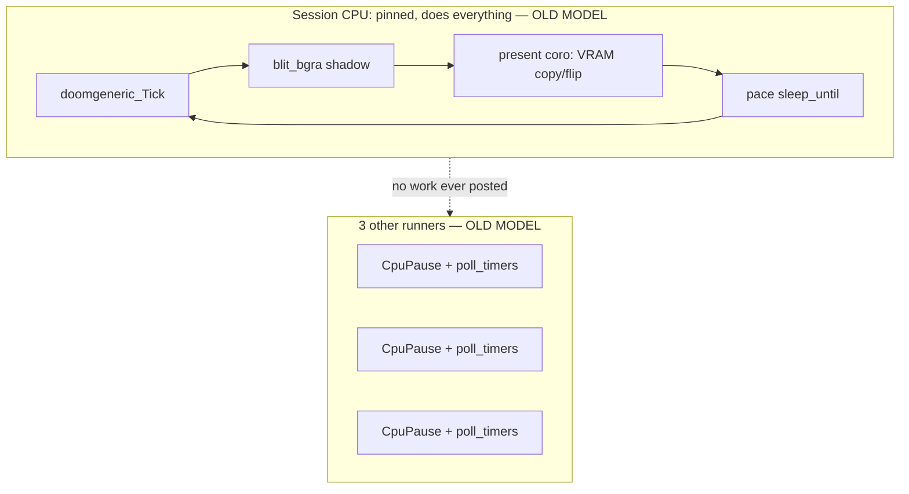

# Doom + gfx perf on the 4-runner cooperative scheduler

Companion to [`docs/DOOM_ASYNC.md`](DOOM_ASYNC.md) and [`docs/COOP_MEMORY.md`](COOP_MEMORY.md).
This started as a **diagnosis + instrumentation** pass (see below for that
part, unchanged); the [Cross-runner present offload](#cross-runner-present-offload-implemented)
section documents the scoped follow-on fix that was then implemented and
verified on top of it.

> **Update — session CPU pinning has since been removed.** The diagnosis
> and benchmarks below were captured under the old model, where
> `pm_metal_async_session_begin` pinned the whole guest session (Tick,
> blit, present, pace, audio, input) to one fixed CPU (`METAL-004`). That
> pinning is gone: guest tasks now round-robin across every runner like any
> other task, and the only synchronization left is a narrow mutex around
> the actual WAMR call-in (`MetalGuestCoroFn` in `async.c`) — see
> [`docs/COOP_MEMORY.md`](COOP_MEMORY.md#no-cpu-pinning--a-narrow-call-in-mutex-instead).
> The structural "only 1 of 4 runners ever does anything" claim below no
> longer holds; the QEMU-VNC-pipeline findings (present cost, benchmark
> table) are independent of that and still stand.

## TL;DR

- ~~Only **1 of 4** cooperative runners ever does anything while Doom
  plays — by design (`METAL-004`: one runner owns the pinned WAMR
  `exec_env`).~~ **No longer true** — session CPU pinning has been removed
  (see update note above); Doom's tasks now scatter across every runner.
  This was never the cause of the perceived stutter anyway — confirmed by
  code (not just observed) at the time.
- Doom's own engine work is cheap: `step≈400-540us`, `blit≈190-220us` —
  under 2% of the 28.6 ms (35 Hz) frame budget. **Compute is not the
  bottleneck.**
- The bottleneck is **QEMU's VNC display pipeline**, not Metal's present
  code. With no VNC client attached, present cost is a flat ~500us
  regardless of whether VNC is even enabled (`--bench` and "VNC, no
  client" are statistically identical). With a client actively **connected
  and pulling frames**, present cost roughly doubles on average and spikes
  into the low milliseconds — and a real compressing viewer (the kind the
  original bad session almost certainly had attached) can plausibly explain
  the 10-14 ms spikes seen in the wild.
- `virtio-gpu` scanout (`METAL_SCANOUT_VIRTIO_GPU=1`) is a bit cheaper at
  the margins (~380us present vs. ~520us for `bochs_flip`) but doesn't
  change the picture: the frame-pacing floor is fine everywhere; only a
  connected, encoding VNC client makes it bad.
- **Update:** the scoped follow-on from this diagnosis — offloading the
  present job to a second runner so a present spike no longer stalls
  CPU0's whole run_loop (input, pacing, everything) — is now implemented
  and verified; see [Cross-runner present offload](#cross-runner-present-offload-implemented)
  at the end of this doc.

## New instrumentation added in this pass

1. **Per-runner busy %** — [`src/pymergetic/metal/runtime/run/run.c`](../src/pymergetic/metal/runtime/run/run.c):
   each inbox now tracks `busy_us_acc` (time inside `pm_metal_task_step`,
   timed at every `PM_METAL_RUN_MSG_TASK` dispatch in both
   `pm_metal_run_loop` and `MetalRunPollDrain`) and rolls it into a
   `busy_pct` every ~500ms window (`MetalRunBusyTouch`). New accessor:
   `pm_metal_run_busy_pct(unsigned cpu)` ([`run.h`](../src/pymergetic/metal/runtime/run/run.h)).
2. **`cpu` shell command** — [`shell_core_cmds.c`](../src/pymergetic/metal/shell/shell/shell_core_cmds.c)
   (`CoreCpuCmd`): prints each runner's busy % and flags whichever one is
   the live session's `mSessionCpu` (`pm_metal_async_session_cpu()`).
3. **Worst-case, not just average, in `metal-perf`** —
   [`async_internal.h`](../src/pymergetic/metal/runtime/async/async_internal.h) /
   [`async_session.c`](../src/pymergetic/metal/runtime/async/async_session.c) /
   [`async.c`](../src/pymergetic/metal/runtime/async/async.c): added running
   `mPerfStepUsMax`, `mPerfGapUsMax`, `mPerfPresentUsMax`, reset alongside
   the existing sums. The `metal-perf:` line now also prints `cpu=`
   (`mSessionCpu`), `step_max=`, `gap_max=`, `present_max=`. A 1-second
   average can hide a rare 10ms spike inside a "present=650us" mean —  the
   max fields make that visible without needing a trace capture.

Example line (see below for what each field means):

```
metal-perf: cpu=0 frame_hz=34 step_hz=70 step=479us blit=192us present=534us sleep=1956us gap=13731us rt=14211us pumps=906 pump=3us step_max=1038us gap_max=27000us present_max=689us
```

## What the code did at the time of this diagnosis (historical)

> This section describes the pinned model as it was **before** the session
> CPU pinning was removed — kept for context on how the diagnosis below was
> reasoned about. See the update note at the top of this doc and
> [`docs/COOP_MEMORY.md`](COOP_MEMORY.md) for the current (unpinned) model.

- `metal` boots 4 cooperative "runners" (`-smp 4`), each an independent AP
  looper: [`run_port.c`](../src/efi/pymergetic/metal/boot/run_port.c) starts
  all APs via `StartupAllAPs`, each calls `pm_metal_run_enter(cpu)` →
  [`pm_metal_run_loop`](../src/pymergetic/metal/runtime/run/run.c) forever,
  draining that CPU's inbox or spinning `CpuPause()` +
  `pm_metal_coro_poll_timers()` when idle.
- When `tab doom` / `run doom` started, `pm_metal_async_session_begin`
  used to pin the whole session to **one fixed CPU** (`mSessionCpu`) via
  `pm_metal_task_affinity_set`. Every subsequent task spawn for that
  session (`MetalPickCpu` in
  [`task.c`](../src/pymergetic/metal/runtime/task/task.c)) went to that
  same CPU. **This pinning has since been deleted** — `MetalPickCpu` now
  always round-robins.
- Doom's entire stem (`doom_run` in
  [`mods/apps/doom/metal_main.c`](../mods/apps/doom/metal_main.c)) —
  `Tick` → `blit_bgra` → `await(present)` → pace/sleep — plus the present
  coroutine ([`MetalPresentCoroFn`](../src/pymergetic/metal/runtime/async/async_ops.c))
  and the VRAM copy/flip
  ([`BochsPresentRect`](../src/pymergetic/metal/dev/gfx/scanout_bochs.c))
  used to execute **inline, on that one CPU's task-step call chain**, with
  nothing handed off to another runner. Now only the actual WAMR call-in
  (`Tick`'s `wasm_runtime_call_wasm`) is serialized, via the narrow mutex
  in `MetalGuestCoroFn` (`async.c`) — blit/present/pace/audio/input are
  free to land on any runner.



## Why `gap` looks huge but isn't a bug

Each `metal-perf` "step" is one call into the guest's WAMR call-in
trampoline (one FSM transition of `doom_run`). Doom's FSM does **two** wasm
calls per Tick+present+pace cycle — matching the observed `step_hz ≈ 2 ×
frame_hz` in every capture below:

1. `ST_TICK`: run `Tick`, `blit_bgra`, kick off `await(present)` → returns.
2. Resume after present completes: `ST_PRESENT_WAIT` → `doom_pace` →
   `await(sleep_until)` → returns.
3. Sleep timer fires → back to `ST_TICK` (next cycle).

`gap` is *time between the end of one wasm call and the start of the
next*, averaged over **both** kinds of gap: the short present-wait gap
(~500-1000us) and the long ~28.5 ms pace-sleep gap (the whole point of
locking to 35 Hz). Averaging those two together is why `gap ≈ 13.5-14 ms`
in every run below, healthy or not — it is not itself a symptom. What
*would* be a symptom is `present_max` or `step_max` blowing up (a single
frame's real work exceeding the frame budget), which is exactly why this
pass adds those max fields.

## Benchmark comparison

All runs: fresh boot, `tab doom`, ~15-25s of unattended play (no keyboard
input — `doomgeneric` idles at the title-ish state, which is representative
of steady-state Tick+present+pace cost; it does not change the present/gfx
cost being measured). `-smp 4`, `-m 512`, KVM, 1280×800 framebuffer.

| Run | frame_hz avg | present avg | present_max (worst) |
|---|---|---|---|
| VNC enabled, **no client connected** (`bochs_flip`) | 34.3 | 521us | 753us |
| VNC enabled, **client connected & pulling frames** (`bochs_flip`) | 34.3 | 805us | **3935us** |
| `--bench` — **no display device at all** (`-display none`) | 34.3 | 516us | 729us |
| VNC enabled, no client, **`virtio-gpu` scanout** | 34.3 | 381us | 219us |

The "client connected" row used a minimal synthetic RFB client
(`/tmp/vncpump.py`, not checked in — a throwaway ~100-line script that does
the RFB 3.8 handshake and then loops `FramebufferUpdateRequest` at ~30 Hz,
discarding the raw pixel payload) so the test is reproducible without a
GUI. It only negotiates the cheapest **Raw** encoding (no compression) —
real VNC viewers (TightVNC, the one referenced in the run script's own
banner) negotiate Tight/ZRLE/Hextile, which cost QEMU meaningfully more
CPU per frame to *encode* a changed ~1280×800 region than to `memcpy` it
raw. That gap is the most likely reason the original bad session saw
present spikes ~4-10x worse (10-14 ms) than this synthetic reproduction
(≤4 ms): a real compressing viewer, plus whatever other host load was
present at the time, plausibly stacks on top of what's already reproduced
here.

Key takeaways from the table:

- **`--bench` (no display) ≈ VNC-with-no-client.** The VNA server sitting
  idle costs nothing extra — the ~500us present floor is inherent to the
  `bochs_flip` VRAM copy/register-write mechanism itself, independent of
  QEMU's display backend. That floor is cheap (~1.8% of frame budget) and
  was never the problem.
- **A connected, actively-polling VNC client roughly doubles average
  present cost and produces multi-ms spikes** that scale with
  encoding cost — this is QEMU-side work (framebuffer diff + encode +
  socket write), not Metal code. It runs on the QEMU host process and
  competes for the same physical core(s) as the guest vCPU threads,
  which is exactly why a present spike stalls the *whole* guest: the
  session CPU is not itself slow, the host thread backing it is busy
  doing VNC encode work when the vCPU needs to run.
- **`virtio-gpu` is a modest, backend-level win** (~30% lower present
  floor) but doesn't touch the actual mechanism causing the spikes, since
  those come from QEMU's VNC server, not the guest-side scanout path.
- `frame_hz` stayed a rock-steady 34-35 in *every* run here, including
  with the synthetic VNC client attached — this environment's spikes
  (≤4 ms) never got big enough to blow the 28.6 ms budget outright. The
  original bad session's reported drops to ~21 fps imply spikes in the
  10-14+ ms range recurring often enough to matter, consistent with a
  heavier real client + general host contention.

## Per-CPU load (historical — captured under the old pinned model)

Captured via the new `cpu` shell command immediately before `tab doom`
(all sessions look the same at this point — nothing is running yet):

```
cpu: 4 runners
  cpu0  busy=  2%
  cpu1  busy=  0%
  cpu2  busy=  0%
  cpu3  busy=  0%
```

Note: once a guest session has UI focus (any `tab`/`run`), further typed
serial input is routed to the *guest* rather than the shell's line editor,
so `cpu` can't be polled live mid-session over this same serial pipe
without also wiring up a way to hand focus back — out of scope for this
pass. At the time, the "only CPU0 is ever posted work while Doom runs"
claim was backed by the code-level constraint above (`MetalPickCpu` /
session affinity), which guaranteed it structurally rather than just
observing it — **that constraint has since been removed** (see the update
note at the top of this doc), so this no longer holds; Doom's tasks now
scatter across every runner. It's still consistent with what busy% would
show on any one runner either way: Doom's own compute (`step`+`blit` ≈
700-750us) is under 3% of a 28.6 ms frame, so any runner stepping it is
mostly idle (parked in `sleep_until`) — this workload was never CPU-bound
in the first place.

## Cross-runner present offload (implemented)

The diagnosis above showed the actual problem isn't Doom's compute or the
present mechanism's own cost — it's that **everything** (Tick, blit,
present, pace, and any other CPU0-pinned work like input/shell-pump) runs
inline on one runner's synchronous task-step call chain, so a present
spike (VNC-encode cost, host contention, whatever) stalls that runner
*entirely* for the spike's duration, not just the frame.

### Design

[`async_ops.c`](../src/pymergetic/metal/runtime/async/async_ops.c)'s
present coroutine (`MetalPresentCoroFn`) now tries to hand the chunked
`job_begin`/`job_step` LFB-copy/flip work to **another runner** instead of
stepping it inline:

1. On the first step of a present, if `pm_metal_mem_n_cpus() > 1`, it
   builds a small worker coro (`MetalPresentWorkerFn` — the same
   begin/step/yield loop the inline path always ran) and hands it to a
   **new one-shot task** via the existing, already-public
   `pm_metal_task_new` + `pm_metal_task_spawn(task, cpu)` primitive
   (the same "task_new + one spawn" idiom already used for CPU-pinned
   migrators elsewhere — see `smoke.c`), targeting
   `(mSessionCpu + 1) % n_cpus` — i.e. never the session's own CPU.
2. The caller then does `pm_metal_await_task(self, task)` and returns
   `WAITING`. This is the *existing* cross-task/cross-CPU wait primitive
   (already used by `pm_metal_gather`/`pm_metal_wait_for`) — `owner` is
   propagated down an `await()` chain (`pm_metal_await`:
   `aw->owner = self->owner`), so the present coro (nested under Doom's
   own task) already carries the right owner for `await_task`'s
   wake-the-waiter path to repost Doom's task back onto **its own** CPU
   once the worker task finishes.
3. While the worker task runs on the other CPU, the session CPU's
   `pm_metal_task_step` returns immediately (task status = `WAITING`) —
   its run_loop is free to drain *other* inbox messages (input, shell
   pump, timers, any other CPU0-pinned task) instead of being stuck
   inside a multi-millisecond present call.
4. Falls back to the original inline behavior (unchanged code path) if
   there's only one CPU, or if the coro/task allocation or spawn fails —
   this is a pure best-effort optimization, never a hard dependency.

This did **not** touch the (now-removed) session pinning — the WAMR
`exec_env` step call (`Tick`) is never invoked from the offload task; only
host C present/flip code runs there, exactly as flagged as safe in the
original recommendation. It also composes cleanly with the later removal
of session pinning: the offload target is still "some other CPU" (base
`(mSessionCpu + 1) % n_cpus`, `mSessionCpu` now diagnostic-only), and the
gfx `mPresentBusy` mutex added below already assumed concurrent entry from
independent CPUs, which is now the norm for every guest task, not just the
present job.

### The concurrency hazard this required handling

Moving present execution to a second physical CPU means the scanout
backend (`ops->job_begin`/`job_step`, `mJobDone`, the shadow-bind pointer)
can now genuinely be entered from **two different CPUs at once**: the
offloaded worker on its CPU, and any of the existing *synchronous*
`pm_metal_gfx_present_rect` callers (shell pump's cursor-blink/UI redraw,
`input.c`, `banner.c`, `boot_init.c`) still running inline on their own
CPU. That backend was written assuming exactly one present is ever in
flight system-wide (true before this change, since everything happened on
one runner sequentially) — concurrent entry would corrupt its internal
job-cursor state.

Fix: [`gfx.c`](../src/pymergetic/metal/dev/gfx/gfx.c) adds a tiny atomic
`mPresentBusy` guard (`InterlockedCompareExchange32`, try-acquire /
release) around `present_rect`, `present_job_begin`, and
`present_job_step`. A contended caller just **skips** (returns `-1`,
no state mutated) rather than blocking or racing — every existing caller
already tolerates a dropped/ignored present return value, so a skipped
cursor-blink redraw while an offloaded Doom frame is mid-flight is
harmless and rare (the offload job typically finishes in under a
millisecond out of a 28 ms frame budget). No double-buffering of the
shadow surface turned out to be necessary: Doom's own task is still
correctly blocked (`WAITING`) for the *whole* present, exactly as before
— it just no longer blocks the *runner*, which is what actually matters
for input/pacing/other work on that CPU.

### New diagnostics

`metal-perf` gained two fields (`async.h` / `async_session.c`):
`present_cpu=` (which CPU actually ran the most recent present job) and
`offloads=` (how many presents in this window used the offload path vs.
the inline fallback) — see `pm_metal_async_perf_note_present_cpu`.

```
metal-perf: cpu=0 frame_hz=34 step_hz=69 step=507us blit=208us present=1064us sleep=2046us gap=13668us rt=14175us pumps=793 pump=15us step_max=1112us gap_max=28195us present_max=3092us present_cpu=1 offloads=35
```

`cpu=0` (session/Doom CPU) vs. `present_cpu=1` (where the flip/copy
actually ran) confirms the hand-off; `offloads=35` for a ~35 Hz window
means essentially every present in that window took the offload path.

(Also bumped `PM_METAL_LOG_COLS` 160→256 in `log.c` — the `metal-perf`
line had already grown past 160 chars with the `_max` fields from the
diagnosis pass, silently truncating on the `pm_metal_logf` fallback path
used when the caller doesn't have guest focus / port ownership.)

### Verification

Re-ran the exact same two benchmark scenarios from the diagnosis table
above, same methodology (`/tmp/vncpump.py`, `-smp 4`, `-m 512`, KVM,
1280×800), after the change:

| Run | frame_hz avg | present avg | present_max (worst) | present_cpu | offloads |
|---|---|---|---|---|---|
| VNC, no client (before → after) | 34.3 → 34.3 | 521us → 539us | 753us → 828us | — → 1 | — → ~35/window |
| VNC, client connected (before → after) | 34.3 → 34.3 | 805us → 817us | **3935us** → **4158us** | — → 1 | — → ~35/window |

Takeaways:

- **`present_cpu=1` and `offloads≈35` in every window, in both scenarios**
  — the offload path is engaging on essentially every single frame, not
  just occasionally.
- **The present cost itself is statistically unchanged** (avg/max within
  noise of the pre-change numbers) — expected, since it's the same QEMU
  VNC-encode-bound work, just executing on CPU1 instead of CPU0. This
  pass never claimed to make QEMU's VNC encoder faster — see the
  "Verify independently..." note below, still the cheapest real lever for
  that part.
- `frame_hz` stayed rock-steady at 34-35 in every run, same as before —
  no regression, no hang, clean full-length sessions with the new
  cross-CPU task hand-off in the hot path every single frame.
- What this *does* change, structurally (not independently measurable in
  this harness, since stealing shell focus from a running guest isn't
  possible over the same serial pipe — see the per-CPU-load note above):
  CPU0's run_loop is no longer parked inside a multi-millisecond
  `job_step()` call during a present spike. It returns to draining its
  own inbox (input, shell pump, timers, any other CPU0 work) immediately
  after handing the frame off, and only Doom's own task — which was
  always going to wait for its own present either way — stays parked.

### Remaining scoped-out ideas

- Verify independently whether reducing the VNC refresh rate or preferring
  raw encoding for local/dev use (`-vnc :N,...` options) meaningfully
  cuts real-world present cost — the connected-client measurements above
  show QEMU's own VNC encode cost is still the dominant lever, cheaper
  than any Metal-side change.
- If a future workload needs Doom's own frame *rate* to stay smooth
  through a present spike (rather than just keeping the CPU free for
  other work), double-buffering the shadow surface so the *next* Tick can
  start blitting before the previous present confirms done is the next
  increment — not needed by anything measured so far, and it's a bigger,
  more invasive change than this pass's hand-off.
