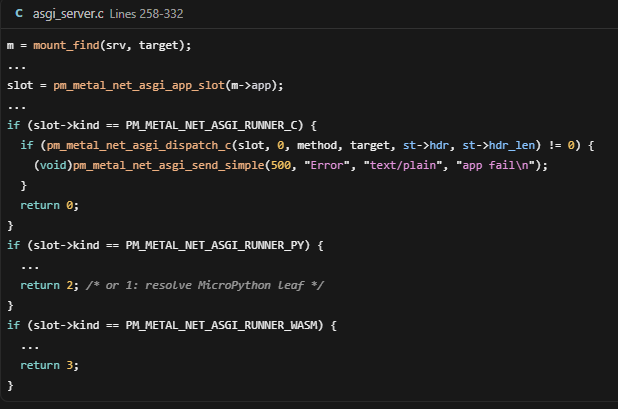

# Metal IO classes + device table

Companion to [`LIBC_ASYNC.md`](LIBC_ASYNC.md) and [`COOP_MEMORY.md`](COOP_MEMORY.md).
**Product IO is Metal ABI + host backends**, not WASI.

Live floor: [`PLATFORM.md`](PLATFORM.md) +
`src/pymergetic/metal/{dt,dev,net,fs}/`. `./scripts/run` examples below are
archived under [`_old/scripts/`](../_old/scripts/).

---

## How we build

| Kind | Rule |
|------|------|
| **sync** | Bounded CPU on the current runner, or non-blocking ring put |
| **sync façade** | Format/copy then enqueue; never park the worker |
| **async** | Returns a handle; completion only via `await` / `guest_step` |
| **omit** | No threads, signals, `select`/`poll`, `setjmp` across await |

Wait on the world → **async**. CPU work → **sync**. Same classes on host and guest.

### Python-shaped async

| Python | Metal |
|--------|--------|
| awaitable / `async def` | `pm_metal_coro_t` / `pm_metal_guest_step` |
| `await x` | `pm_metal_await` / `pm_metal_async_await` |
| `create_task` | `pm_metal_create_task` / `pm_metal_async_create_task` |
| `sleep` / deadline | `sleep_us` / `sleep_until_us` |
| `sleep(0)` | `yield` |
| event loop | **N equal runners** (`run_poll` / `run_loop`) |

### N CPUs = N runners — no Extrawurst

- `n_cpus` stacks + inboxes + cooperative runners — all equal.
- Same work/input path; **FCFS** — who drains a ready task first serves it.
- **No CPU0 pin** for wasm/guest sessions. `create_task` round-robins; session pump drains **all** inboxes.
- Never await while holding a lock.

---

## IO class table

| Class | Sync poll / get | Sync façade | Async await | Backends (examples) |
|-------|-----------------|-------------|-------------|---------------------|
| **time** | `mono_us`, wall clock | — | `sleep_us`, `sleep_until_us` | TSC |
| **gfx** | size/origin | clear/fill/blit + sync `present` | `async_present` (fence) | compositor shadow → **scanout backend** (`virtio_gpu` / `bochs_flip` / `radeon_rv370` / `i915_855gm` sample / `gop_blt` / `lfb_copy`); harvest: Multiboot / Bochs / VESA / EFI GOP |
| **audio** | `ready`, `muted`, `volume_get`, `backend` | `queue`, `mute`, `volume_set` | `drain` | virtio-snd (probe), else **AC97** (ICH / QEMU `-device AC97`), else null; shell `audio`/`vol` + status-bar slider |
| **input** | `poll_key` / `poll_key_event`, `poll_pointer` | — | omit v1 | virtio-tablet (absolute, QEMU/VNC) when present; else efi ConIn+i8042 / bios i8042; tab focus gates guest vs shell |
| **fs** | transitional sync size/read | — | open/close/read/write + sync `lseek`; stat/readdir/mkdir/unlink/rename/fsync | ESP cache (+ SimpleFileSystem pre-EBS) |
| **blk** | `count`/`at`/`ready`/`capacity` | — | `read_async`/`write_async` | virtio-blk, ide-ata (multi-device) |
| **stream** | attrs/winsize | `write` if space | `read` / drain | uart, ui_tab, pipe, pty, virtio-console |
| **net** | — | `send` if space; `bind_if` | connect/listen/accept/recv/dns (+ ping/http/tftp/ntp modules) | lwIP + `lo` + virtio-net / bge (`eth0`…) |
| **random** | `random` fill | — | — | EFI RNG / weak |

Rules: guest never imports EFI device protocols as product ABI; backend vtable + DT node per live class.

---

## Metal DT (device / capability table)

Append-only inventory of **present** devices: class + `compat` + caps + bus/loc.  
Not Linux FDT. Multiple nodes per class are normal. Platform-agnostic — QEMU and real PCs share the same table shape; only discovered nodes differ.

```text
time/tsc
gfx/framebuffer                 (floor: + `pci VVVV:DDDD @bus:dev.fn` when VGA found; after bind → gfx/<scanout>)
fs/esp | fs/embed
input/ps2+com1
input/virtio-tablet            (if `-device virtio-tablet-pci`)
stream/uart+ui
stream/virtio-console#1     (if detected)
net/loopback + net/lwip+virtio-net | net/lwip+bge   (`lo` + eth0…)
audio/virtio-snd | audio/ac97 | audio/null
random/efi-or-weak | rdrand-or-weak
blk/virtio-blk#0            (if detected)
blk/ide-ata#0               (if detected; master/slave each get a node)
```

**Detect → add → bind:** harvest runs every linked detector. Each detector adds zero or more DT nodes for what it finds and binds its driver — no fallback chain (virtio and IDE both run; both can appear). Floor + bus harvest are common (`boot_harvest.c`); seed/init / proofs / shutdown are common `boot_init.c`. Bind hooks are only the deltas: `pm_metal_boot_port_floor()` (fs/random compat, BIOS PS/2 prep) and `pm_metal_boot_port_seed()` (handoff/`ebs` log).

Blk detectors: `pm_metal_blk_virtio_detect`, `pm_metal_blk_ide_detect` (legacy ISA `0x1F0`/`0x170` IDENTIFY). Virtio-pci IDs unchanged: net `0x1041|0x1000`, blk `0x1042|0x1001`, console `0x1043|0x1003`, input `0x1052`, sound `0x1059`.

**Harvest vs product bind:** sync floor harvests DT + GOP/framebuffer; boot tree prints full DT inventory under `devices`. After EBS / BIOS floor the seeded init task binds gfx → UI → net → wasm → shell (UI paints before NIC open so the FB is not stuck on GOP residue). Proofs are manual (`test` shell command — registered from `boot_shell.c`). **UI is not a DT node.**

### Net (multi-if + DHCPv6)

- Host ifs: always `lo` (127.0.0.1/8, ::1) plus `eth0`… (`PM_METAL_NET_IP_MAX_IFS`). Default route prefers ethN when present. Shell: `net status [lo|ethN]`, `net set [ethN] …`, `net set [ethN] dhcp`, `net set [ethN] dhcp6 off|stateless|stateful`.
- **Iface events:** lwIP status/link/ext callbacks bump `pm_metal_net_ip_if_gen()`. Poll gen or `await pm_metal_net_ip_if_wait(since)` / Python `ip.if_gen()` + `await ip.if_wait(g)`. Snapshots: `ip.ifaces()` / `ip.iface([name])`. Guest WASI: `if_count`, `if_gen`, `if_wait`, `if_status_index`. Config `if_set*` stays host/shell.
- **I/O budget:** wire chunk `PM_METAL_IO_WIRE_MAX` (32 KiB) for TLS/HTTP-client/py-recv; ASGI server iobuf `PM_METAL_ASGI_IO_MAX` (4 MiB). See `include/pymergetic/metal/net/io_budget.h`.
- DHCPv6: **stateless** via lwIP; **stateful** via Metal client (`metal_dhcp6_stateful_*`) — lwIP `dhcp6_enable_stateful()` remains a stub.
- Guest sockets: `pm_metal_net_ip_bind_if(h, "lo"|"eth0")` before connect/listen (NULL → default).
- **Name layers:** `util/ip` = IPv4 literals only (`ip4_parse` / `ip4_is_literal`). Local nodename = sync `pm_metal_host_name_get/set` (default `metal`; shell `hostname`; optional `hostname=` in `metal/net.conf`; sent as DHCPv4 option 12). Resolve order for connect/dns: literal → `localhost`/nodename → VFS `/etc/hosts` (ESP `etc/hosts`) → async DNS. After successful `pm_metal_net_ip_dns` await: `pm_metal_net_ip_dns_last_ntoa` (guest/host). Shell: `nslookup <host>`.
- **DHCP boot/TFTP:** lease exposes next-server (`siaddr` / opt 66) + boot file (BOOTP file / opt 67) via `pm_metal_net_ip_if_boot_get` / `ifcfg.tftp`+`boot_file`. Generic async client: `pm_metal_net_tftp_get(host, path, dest, cap)` (host/path empty → DHCP next-server + bootfile). Guest proof: `async_tftp` (EFI verify uses QEMU `-netdev user,tftp=…,bootfile=…`).
- **Net life:** background coro (`pm_metal_net_ip_life_start`) — fast poll while no lease, slow while up; ASGI/SSH autoload on lease-up; NTP after. DHCP/NTP success quiet.
- **Pkg HTTP seed:** `guest/pkg/pkg_seed.c` on `pkg_ensure` / `pkg_ensure_assets` (load/run only, never lease auto-fetch). Host = DHCP next-server, else gw, else optional `CONFIG_PM_METAL_NET_PKG_SEED_HOST` (`pm_metal_net_ip_seed_host`; empty = no compile-time host).
- **Tray colors:** red = no IPv4; amber = IPv4 but no DNS string; green = IPv4 + DNS (slot 0 or backup slot 1).
- **Fullscreen guest (`run`):** shell skips chrome/prompt paint and status dirty; host pump sleeps 1 ms while a process is live. `blit_bgra` writes the logical surface; one `async_present` fence per guest frame. Apps never select a scanout backend.
- **Scanout backends** (`include/.../gfx/scanout.h`, probe at gfx bind): compositor stays in `gfx.c`; present goes through `pm_metal_scanout_ops`.
  1. **`virtio_gpu`** — virtio-gpu resource + `TRANSFER_TO_HOST_2D` / `RESOURCE_FLUSH` (QEMU: `METAL_SCANOUT_VIRTIO_GPU=1 ./scripts/run efi`)
  2. **`bochs_flip`** — QEMU stdvga VBE virt_h 2× + `Y_OFFSET` page-flip (+ optional DIRECT shadow in back page)
  3. **`radeon_rv370`** — T43 Mobility X300 (`1002:5460`): PCIe GART→shadow, MMIO 2D→front (no flip); probe requires VRAM blit + GART readback or fall through to `lfb_copy`
  4. **`i915_855gm`** — sample Gen2 Intel (PCI `8086:3582` T42): GGTT + ring blit + `DSPAADDR` flip
  5. **`gop_blt`** — pre-EBS EFI GOP `Blt`
  6. **`lfb_copy`** — post-owned chunked shadow→LFB memcpy (generic iron fallback)
  Layers: **lower** (`scanout_*`) = physical copy/flip only (no busy-wait); **upper** = surfaces for widgets; **ops** = blit/fill/text/present on surfaces. Shared **60 Hz** frame pace. Caps: `TEAR_FREE`, `CHUNKED`, `DIRECT` (not auto). Bound backend shows on init (`| +-- gfx ok <scanout> WxH`) and in the DT compat after bind (`hwinfo`).
- **SNTP:** `pm_metal_net_ntp_sync(host)` (UDP/123); on success sets wall via `pm_metal_realtime_set_unix_ms`. Status clock / `date` use local TOD (`tz` minutes; default `Europe/Berlin` +120; `metal/net.conf` `tz=` / `timezone=`). Clock tint amber until NTP; tray ifaces green = IP+DNS (lo: IP only), amber = IP without DNS, red = down.
- **Ping / DNS under QEMU user-net:** SLIRP may drop or ignore ICMP; `ping` retries briefly for ARP/`ERR_RTE`. Shell jobs must treat `WAITING` like `PENDING` (sleep/DNS park). `net` shows DHCP DNS (QEMU → `10.0.2.3`); `8.8.8.8` is only a silent lwIP backup if that proxy fails. Prove L3 with `nslookup`, HTTP, or TFTP when ICMP is filtered.

### Shell command registry

Topic modules place commands with `PM_METAL_SHELL_CMD` / `PM_METAL_SHELL_CMDS` into linker section `.pm_metal_shell_cmds.*`. `pm_metal_shell_cmds_install()` walks `__pm_metal_shell_cmds_{start,end}` (cap `PM_METAL_SHELL_CMD_MAX` = 128). No manual `register_*` list.

### Externals registry

Third-party stack identity (MicroPython, WAMR, lwIP, mbedTLS,
microtar, …) self-registers with `PM_METAL_EXTERNAL` into
`.pm_metal_externals.*` — same linker-section idiom as shell cmds / keyb
layouts. Guest-only stacks (Microdot, utemplate, …) register at runtime via
`pymergetic.metal.externals.register` from `/mods/<name>/autoload.py`
(path-exec once on the shared µPy context — REPL banner and after stdlib is
on `sys.path`). This is **not** the mod registry and **not** Metal's own
`authors` / `about` record. Surfaces: shell `externals`, Python
`pymergetic.metal.externals` (`list` / `get` / `register`), WASI
`pymergetic.metal.externals`, HTML/JSON `/externals` + `/api/externals` (see
[`screenshots/externals.png`](../screenshots/externals.png)), and the
MetalPython boot banner (`Metal <ver> @ <cpu>` plus `  - <id> <version>`
bullets).

### Mem limit catalog

Compile-time memory/buffer budgets (wire chunks, ASGI iobuf, lwIP opts,
virtio-net rings, µPy/WAMR heaps, …) self-register with
`PM_METAL_MEM_LIMIT` into `.pm_metal_mem_limits.*` — same linker-section
idiom as externals. Lookup id is `module.name` (e.g. `net.asgi.ASGI_IO_MAX`).
Surfaces: shell `limits`, Python `pymergetic.metal.mem.limit`, WASI
`pymergetic.metal.mem.limit`, and HTML/JSON at `/limits` + `/api/limits`
(see [`screenshots/limits.png`](../screenshots/limits.png)).
Header: `include/pymergetic/metal/runtime/mem/limit.h`.

API: `pm_metal_io_dt_add` / `get` / `count` / `by_class` / `foreach` / `lookup` (first of class). Guest `io_query` optional later.  
Tree: `bus/` (DT + virtio PCI) · `dev/<class>/` (detectors + backends).

---

## Stream plumbing (stdio / TTY / pipes)

Endpoints: `uart`, `ui_tab`, `pipe`, `pty` (master/slave), later `virtio_console`.  
`stdio_attach(in,out,err)` binds a session.

### SSH console

SSH is planned as a console viewport onto the shared Metal console (UART/UI)
via a PTY pair (`pm_metal_stream_termios_*` / `pm_metal_stream_winsize_*`),
not a separate stream feature. Hybrid module `pymergetic.metal.net.ssh`:
C impl + RS/Py export faces (`pm_metal_net_ssh_*`). Stub today
(`available()` false; live-ssh may send an SSH-2.0 ident banner on TCP :22
without crypto). Real server/client (wolfSSH or DIY) will listen on port 22
and attach each session to a PTY.

Metal job control (not POSIX signals): Ctrl-C cancels the foreground shell
async job, Ctrl-Z stops it; `jobs` / `fg` / `bg` list and resume. POSIX
`fork`/`kill`/signals stay omitted.

`/etc/sshd.json` will configure port, host-key path, session budget, and
auth methods when a real SSH backend is linked.

### SSH sslcert auth

`/etc/sshd.json` may add `"sslcert"` to `auth.methods` and set
`auth.client_ca` to the PEM or DER client CA. The client sends a DER leaf
certificate whose subject is exactly `CN=<local-user>`; Metal verifies its
chain and verifies the request signature with that leaf's public key before
accepting the mapped user.

This is the Metal `sslcert` SSH userauth extension, not an OpenSSH-standard
method. Its payload is `boolean true`, certificate DER, and a DER signature
over `string(session_id) || SSH_MSG_USERAUTH_REQUEST` through the certificate
field. A client must implement that extension; ordinary OpenSSH clients can
continue to use `passwd` or `pubkey`.

### ASGI httpd

The ASGI HTTP service is configured by `/etc/httpd.json` and controlled from
the `httpd` shell command. Its route registry accepts native C, MicroPython,
and wasm ASGI leaves, so one listener can mount applications from each
runtime. TLS and WebSocket upgrades are handled by the server rather than by
individual applications. Microdot is the small Python-friendly layer on top
of the same ASGI registry; it is not a second HTTP server.

Longest-prefix `mount_find` picks the route; the leaf's runner kind selects
the backend. Host and guest both use `pm_metal_net_asgi_mount`; wasm apps
self-register (`pm_metal_net_asgi_register_wasm`) so the kernel need not know
them ahead of time. Builtins for config: `c:health`, `c:static`,
`py:httpd`.

| Dispatch | Config |
|:---:|:---:|
|  |  |
| `asgi_server.c` — mount → C / Py / wasm | `mods/etc/httpd.json` — path → app |

Wasm proof mod `asgi_hello` (embedded): shell `asgi_hello` registers a wasm
ASGI leaf, listens on port 18080, mounts `/hello`, and replies
`asgi-hello` via `pm_metal_net_asgi_send_simple`.

Wasm proof mod `asgi_hello` (embedded): shell `asgi_hello` registers a wasm
ASGI leaf, listens on port 18080, mounts `/hello`, and replies
`asgi-hello` via `pm_metal_net_asgi_send_simple`.

See also [MODS.md](MODS.md) for wasm registration and
[`_old/docs/MICROPYTHON.md`](../_old/docs/MICROPYTHON.md) for Python ASGI applications.

---

## Input notes

- Product keycodes are **Metal** HID usage IDs (positional USB usage; not KEYB layout). Full page-0x07 coverage: letters/digits/nav (original) plus punctuation, Caps/Num/Scroll-Lock, F11/F12, Insert/Home/Delete/End, the full numpad, ISO 102nd-key, and L/R GUI + Menu (`include/.../dev/input/input.h`). AT Set-1 → HID table in `keyb.c` cross-checked against 3 independent scancode references; live-verified via scripted QEMU `sendkey` injection (apostrophe/semicolon/comma/period/slash/brackets, Home+Delete line-editing, `keyb de` umlauts).
- Guest ABI: `pm_metal_input_poll_key_event` (preferred) and convenience `pm_metal_input_poll_key` (pressed + code). Host and wasm imports share the same shapes. Punctuation/nav/GUI keys now resolve to real HID codes under guest focus too (previously `PM_METAL_KEY_NONE` — silently dropped, not garbled).
- Home/End/Delete are wired into shell line-editing (`pm_metal_ui_input_move_cursor` clamp + new `pm_metal_ui_input_delete_fwd`); previously these were dropped before reaching the shell (`ext=1` + not in the nav-key allowlist -> `continue`).
- Tab focus: shell vs guest; only the focused surface drains keys (avoids shell eating guest input).
- Shell ASCII uses DOS KEYB (`keyb us` / `keyb de`); guests keep HID under layout changes. `keyb de`'s umlauts/ß/§/°/´ are Latin-15 bytes >= 0x80 — `MetalShellHandleAscii`'s `ch<127` gate used to sign-extend and silently drop every one of them before they reached the input line; fixed to treat the byte as unsigned and only exclude DEL (0x7F).
- `keyb` is not persistent across reboot (defaults to `us` every boot) — re-run `keyb de` after each boot if needed; the *physical* "US apostrophe" key position produces German `a-umlaut` under `de` (real DE keyboard behavior) — `'`/`"` live at Shift+`#`-key / Shift+`2` instead. The layout's id was renamed `gr`→`de` (`de` for "Deutsch", matching how everyone actually says/types it); `gr`/`keyb gr` still work as an alias (`.aliases = "gr"` in `keyb_layout_de.c`) — nothing that already typed `keyb gr` breaks.
- Status bar shows the active layout as a 2-letter chrome cell left of the FPS cell (`paint.c`'s `MetalUiPaintStatusBar`); `Ctrl+Alt+Home` cycles to the next registered layout without touching the keyboard at all (`MetalShellKeybChordFilter` in `shell.c`, dispatched through the same single `pm_metal_input_set_filter` slot as the Ctrl+Shift+Left/Right tab-cycle chord) — the escape hatch for a crippled/foreign physical layout where you can't reliably type `keyb de` in the first place. Home was picked as the trigger key (not a mnemonic letter) because under shell focus the PS/2 port only `push_key`s mods/nav keys to the filter; plain letters go straight to the ASCII ring and never reach it (see `input_port.c`).
- **Registry footgun (fixed, keep in mind if you add a 3rd layout):** each `pm_metal_keyb_layout_t` is `aligned(16)` (matches `PM_METAL_SHELL_CMD`/`PM_METAL_PY_BIND`'s self-registration idiom — dropping the alignment "cleans up" the padding but reproducibly hangs EFI boot at `ExitBootServices`, root cause not fully understood, don't do it), but `sizeof(pm_metal_keyb_layout_t)` (280) isn't a multiple of 16, so the linker inserts 8 bytes of padding between the `us` and `de` objects. `keyb.c`'s registry walk (`KeybLayoutAt`/`KeybLayoutCount`) steps by the *aligned* stride (`(sizeof + 15) & ~15`), not by naive `arr[i]` — the latter silently read into the padding for every index past 0 (index 1's `name` came back NULL, and its `unshift`/`shift` tables were offset by 8 bytes, garbling every keystroke once you switched away from index 0).
- **Real-HW scancode debugging (`ps2trace`):** QEMU's i8042 is a clean, quirk-free emulation and can't reproduce a specific keyboard's EC/8042 chipset misbehaving (wrong wire byte, translate bit not honored, AUX/kbd status-bit misrouting, ...). Static review of a report like "Backspace prints a digit on my ThinkPad but not in QEMU" can rule things out (this build's `keyb_layout_us.c`/`keyb_layout_de.c` map set-1 `0x0E`→`0x08` correctly; only set-1 `0x0A`/`0x49` map to `'9'`, and neither the shell's `ch==0x08` backspace handler nor Tab/history code can turn `0x08` into a printed digit) but can't prove what a *specific* real machine puts on the wire. Run `ps2trace on`, reproduce, then read the log: both ports' i8042 drain (`src/{efi,bios}/pymergetic/metal/dev/input/input_port.c`) log every raw keyboard-channel byte (`ps2kbd: raw=XX`, before any E0/break-bit/translate interpretation) plus the decoded result reaching the ASCII ring (`ps2kbd: sc=XX shift=N hid=N ascii=XX`). AUX (mouse/TrackPoint) bytes are never logged. `ps2trace off` to stop; state isn't persisted across reboot.
- Pointer lock is surface-scoped (`DEFAULT` or tab); unlock on Escape / lifecycle blur.
- UI software cursor (save/restore + dirty-rect present) + tab-strip hit-test/hover when unlocked.
- **Console scrollback:** each tab console holds a 1024×160 ring (`CONSOLE_BYTES_MAX`); `view_off` sticks to bottom unless scrolled. Scrollbar on the right; shell focus handles wheel (`PTR_WHEEL`, `dy` = ticks toward older history), thumb click-drag, track jump, and PageUp/PageDown (`pm_metal_ui_console_scroll_page`).
- **Command history:** shell keeps up to `PM_METAL_SHELL_HISTORY_MAX` (64) committed lines (skips empty / consecutive dup). Up/Down recalls like bash (`PM_METAL_KEY_*` or CSI `ESC [ A/B` on the ASCII path); `history` lists them.
- **Prompt:** bash-like `hostname:~$ ` (green host / blue `:~` / green `$` on UI + COM1 ANSI; space after SGR reset so serial keeps it).
- **Tabs:** click the tab strip, shell `use <n>`, or **Ctrl+Shift+Left/Right** (wraps; works under shell or guest focus so a guest tab is not a dead end). Needs i8042 make/break (BIOS / EFI post-owned); plain ConIn has no modifier state.
- **Pointer:** Pre-EBS EFI uses Absolute/SimplePointer (wheel via `RelativeMovementZ`). After takeover, prefer **virtio-tablet** (absolute X/Y + `EV_REL`/`REL_WHEEL` for VNC scroll); else i8042 AUX (IMPS/2). When tablet is ready, AUX deltas are ignored so the host cursor stays aligned.

## Lifecycle

- Sync poll: `pm_metal_lifecycle_poll` / `lifecycle_focused`.
- Host sets focus on session start; `lifecycle_blur` on session end (unlocks pointer).

## Process

**Target** ([`docs/MODS.md`](MODS.md)): **process = registered shell command runs a function in a task.**  
Mod load ≠ process. Plain function call-in ≠ process. Commands are special funcs; Shell uses cmds; µPy later can use funcs and cmds.

**Today:** `run`/`tab` → `mod_cmd_invoke` (registered cmd → func in a task).
Still one live call-in/session. API: `guest/mod/mod.h`, `guest/process/process.h`,
WASI `pymergetic.metal.mod` + `pymergetic.metal.process`, `PID=` env, `ps`.

---

## Status

Landed: DT, time µs, present, audio null, input pointer/lock + guest `poll_key`, FS write, lifecycle,
stream (uart/ui_tab/pipe/pty + stdio_attach), net lwIP multi-if + virtio/bge + bind_if + stateful DHCPv6,
shell linker-section registry, random/realtime, tab surfaces + clipped present, unlocked UI cursor + tab-strip hit-test,
console scrollback/scrollbar + EFI/BIOS wheel + PageUp/Down,
Ctrl+Shift+Left/Right tab cycle,
`shell_log`/WASI stdout → stdio streams, `gfx_set_surface` for tab-clipped guest draw,
process/ps/`PID=` still on today’s inverted guest-session path ([`docs/MODS.md`](MODS.md) target).  
Framebuffer on BIOS i386: Multiboot tag → Bochs → **VESA LFB** (`vesa.c`); x86_64 BIOS still stubs VESA RM. Audio: virtio-snd, else **AC97**, else null. Names/TFTP: hostname + `/etc/hosts` + `pm_metal_net_tftp_get`.  
Open follow-ups: `docs/TODO.md` (mostly iron smoke); mod registry migration; overlay view.
